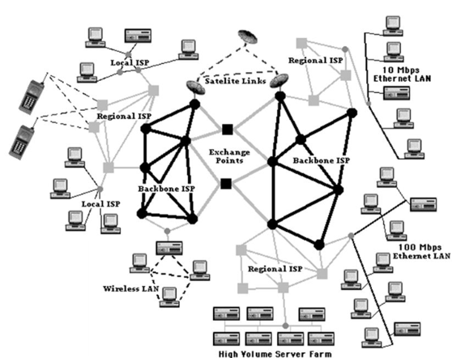
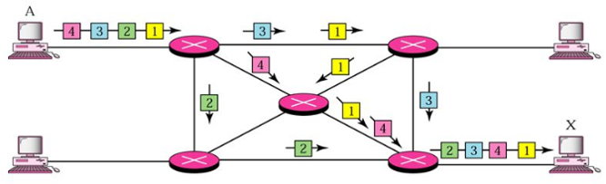
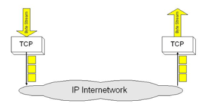
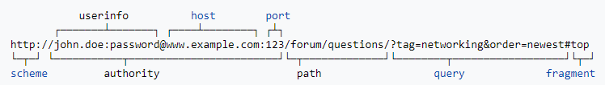
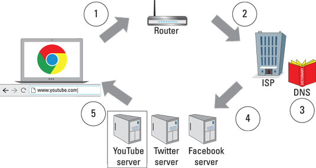
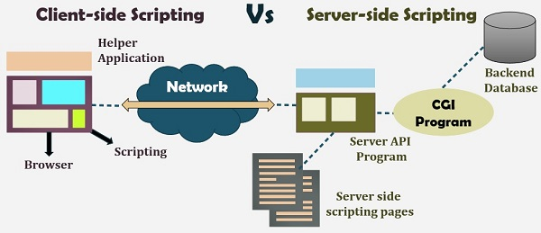

# Introductie in web development

Laten we eerst even kijken naar de infrastructuur die we gebruiken om de web informatie bij de gebruiker te krijgen.

De infrastructuur gebruikt om informatie over de wereld te verspreiden noemen we internet. Internet is eigenlijk een netwerk van netwerken. Om deze informatiestroom op gang te krijgen zijn enkele protocols van kracht.

##### IP-protocol

Het **I**nternet **P**rotocol definieerd de manier waarop informatie is verzonden d.m.v pakketjes langs een willekeurige weg naar de ontvanger. Die informatie kan allerhande data bevatten. Dit protocol gebruikt de 'best-effort' techniek om die data te bezorgen zonder enige vorm van fout- of datastroom controle. 
 

##### TCP-protocol

Het **T**ransmission **C**ontrol **P**rotocol verzekerd het aanleveren van IP pakketjes zonder verlies van pakketjes en zorgt er ook voor dat deze in de juiste volgorde aangeleverd worden. De tijd nodig om de data te versturen is onderschikt aan de zekerheid dat alle data correct aangeleverd wordt.
 

##### HTTP-protocol

**H**yper**T**ext **T**ransfer **P**rotocol is een applicatie protocol dat de taal definieerd om clients en servers te laten communiceren. Het is tevens ook het protocol die gebruikt wordt om webpagina's te versturen en ontvangen.

##### DNS

**D**omain **N**ame **S**ervers zijn zoals het adressboek voor websites. Als je een web adres in je browser intikt, dan zoekt de browser via DNS het werkelijke adres van de site alvorens het te kunnen ontvangen van de website. De browser moet bepalen op welke server die website staat zodat het een HTTP boodschap naar de juiste plaats kan sturen.
 
##### IP adres

Een IP adres is een set van vier nummers gescheiden door een punt (vb 192.168.1.1). Net zoals je thuisadres is dit een uniek nummer voor elk toestel die op een netwerk gekoppeld is.

## Hoe wordt een website aangeleverd aan jou browser ?

1. Jou computer stuurt een aanvraag voor een webpagina naar de router. De router verzorgt internet toegang voor jou huis of werkplek.

2. De router stuurt vervolgens jou aanvraag door naar jou Internet service provider (ISP). 

3. Jou ISP converteert de tekens van you URL aanvraag naar een IP adres.

4. A.d.h.v. het IP adres weet jou ISP nu naar welke server jou aanvraag en jou IP adres moet verstuurd worden. 

5. De website server ontvangt jou aanvraag en stuurt een kopie van de webpagina code naar jou computer zodat jou browser die kan tonen.

6. You browser zal tot slot de code interpreteren en de webpagina tonen op het scherm.

 

## Client side of Server Side ?

Een statische webpagina is gebouwd met **HTML** (inhoud) en **CSS** (stijl). Dit is opgebouwd op het WYSIWYG principe. Het is een zeer flexibele manier om webpagina's te bouwen maar je hebt steeds een IT specialist nodig voor wijzigingen.

Een dynamische webpagina heeft extra scripts. Meestal zijn deze webpagina's gebaseerd op een sjabloon. Het aanbrengen van wijzigingen is hier veel eenvoudiger, geen IT specialist nodig.

**Javascripts** worden aan de client-side uitgevoerd, terwijl **PHP**, ASP.NET,... scripts aan de server-side uitgevoerd worden.

 

