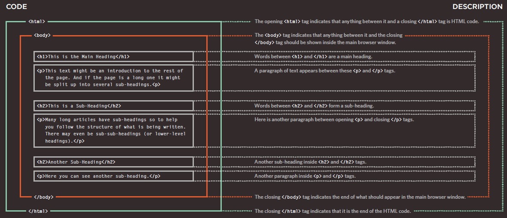
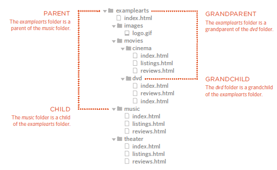
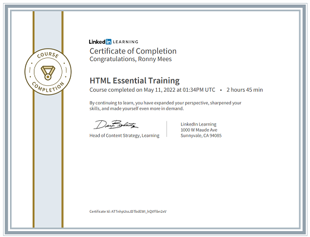

# De structuur van een webpagina met HTML


[Hier](/files/cheatsheet_html.pdf) kan je een cheatsheet terugvinden ter ondersteuning van taken, toetsen, projecten en werkplekleren.

De structuur van een webpagina wordt opgemaakt via HTML, dat is de standaard **markup language** om web pagina's aan te maken. HTML staat voor **H**yper **T**ext **M**arkup **L**anguage. Het beschrijft de structuur van een webpagina a.d.h.v. HTML elementen die de browser vertellen hoe de pagina inhoud gestructureerd is. 

HTML elementen, ook **tags** genoemd, zijn als een soort containers. Ze vertellen iets over de informatie binnenin hun **opening tag** en **closing tag**.



Laten we nog even zo'n tag nader bekijken:

```html
<a href="https://www.vives.be">Visit VIVES</a>
```
* `<a>` is hierbij de **opening tag**
* `href` is hierbij een **attribute name**
* `"https://www.vives.be"` is hierbij een **attribute value**
* `</a>` is hierbij de **closing tag**

## Ontwikkeltools

Omdat HTML eigenlijk gewoon tekst is, kan je jou favoriete tekstverwerker zoals Notepad, Notepad++, Visual Studio Code, Brackets, ... hiervoor gebruiken. Sommige van die editors bieden ook een 'live preview' wat zeer handig is terwijl je jou pagina ontwerpt.

We maken gebruik van Visual Studio Code om onze projecten in te bouwen.
Als dit nog niet op jou systeem geïnstalleerd staat, ga dan naar [de website van Visual Studio Code](https://code.visualstudio.com/) en download er de versie voor jou systeem.
Tijdens de installatie zorg je ervoor dat volgende 2 opties aangevinked staan:


Na installatie voeg je ook de **live server extensie** toe.
Bekijk [de gebruikersgids van Visual Studio Code](https://code.visualstudio.com/docs/editor/extension-marketplace) voor meer informatie hoe je dit moet doen.


## De basisstructuur

Hoe ziet de basisstructuur van een webpagina er nu eigenlijk uit?

Als je een nieuw HTML document start dan ziet de basisstructuur er als volgt uit:

```html
<!DOCTYPE html>
<html lang="en">
    <head>
        <meta charset="UTF-8">
        <meta http-equiv="X-UA-Compatible" content="IE=edge">
        <meta name="viewport" content="width=device-width, initial-scale=1.0">
        <title>Document</title>
    </head>
    <body>
        
    </body>
</html>
```

Laten we dit even nader bekijken.

Alle HTML documenten moeten starten met een document type declaration `<!DOCTYPE html>`.

Het HTML document zelf start met `<html lang="...">` en eindigt met `</html>`. Hierbij is `lang="..."` belangrijk voor tekst voorleessoftware, het kan anders nogal vreemd klinken :-).

Het HTML element `<head>` is een container waar informatie over de pagina in terecht komt. Metadata wordt niet getoond op de pagina. Het `<meta>` element wordt gebruikt om metadata zoals de pagina beschrijving, zoektermen, auteur, ... te specificeren.

Bijvoorbeeld:

```html
<meta charset="UTF-8">
<meta name="description" content="Free Web tutorials">
<meta name="keywords" content="HTML,CSS,XML,JavaScript">
<meta name="author" content="John Doe">
<meta http-equiv="refresh" content="30">
<meta name="viewport" content="width=device-width, initial-scale=1.0">
```
* Het `<meta>` charset element geeft aan welk tekenset er gebruikt wordt.
* Het `<meta>` description element legt de beschrijving voor de webpagina vast.
* Het `<meta>` keywords element bepaald zoektermen voor de webpagina op zoekmachines zoals google.
* Het `<meta>` author element bepaald de auteur van de webpagina.
* Het `<meta>` refresh element legt vast om de hoeveel tijd de pagina zichzelf zal vernieuwen.
* Het `<meta>`  viewport element geeft instructies aan de browser om rekening te houden met de device-width bij het weergeven van elementen op de pagina.

Het zichtbare deel van het HTML document kan je terugvinden tussen `<body>` en `</body>`.

::: tip Zorg voor een leesbaar HTML document

**1. Maak gebruik van insprongen**

Je kan insprongen automatisch toevoegen in Visual Studio Code door voor `format document` te kiezen in het rechtermuis menu.
Het bevorderd de leesbaarheid van je HTML document.

**2. Plaats commentaar bij je code**

Het toevoegen van commentaar aan je HTML document kan zorgen voor meer duiding bij een bepaald stukje code waardoor de lezer sneller begrijpt wat er gebeurt.

```html
<!-- This is a comment line -->

<!-- And this is
a comment
block -->
```
:::

## HTML elementen

Welke elementen hebben we nu allemaal ter beschikking om onze pagina structuur te geven ?

### Tekst

#### Hoofding

Een hoofding kan je aangeven met de `<h1>` tot `<h6>` tags. Waarbij de `<h1>` de meest belangrijkste hoofding is en de `<h6>` de minst belangrijke.

```html
<h1>Heading 1</h1>
<h2>Heading 2</h2>
<h3>Heading 3</h3>
<h4>Heading 4</h4>
<h5>Heading 5</h5>
<h6>Heading 6</h6>
```

::: warning Noot

Hoofdingen worden door zoekmachines gebruik om de structuur van je webpagina te bepalen. Je gebruikt ze dan ook uitsluitend daarvoor en niet om bepaalde tekst groter of vetjes te krijgen.
:::

#### Paragraaf

Een paragraf kan je herkennen aan het `<p>` element. 

```html
<p>This is a paragraph.</p>
<p>This is another paragraph.</p>
```

::: warning Noot

In jou html code kan je extra spaties of lijnen toevoegen, maar de browser zal deze negeren en de tekst als een lange doorlopende tekst weergeven.
Als je een nieuwe lijn wil in een paragraaf kan je hiervoor `<br>` gebruiken.
:::

#### Formatering

Alle tekst in een html document kan geformatteerd worden door volgende elementen:

* `<b>` -   vet
* `<strong>` - belangrijk
* `<i>` - cursief
* `<em>` - benadrukt
* `<mark>` - gemarkeerd
* `<small>` - klein
* `<del>` - gewist
* `<ins>` - toegevoegd
* `<sub>` - subscript
* `<sup>` - superscript

#### Speciale characters

Enkele veel gebruikte characters:

* `&copy` - copyright
* `&reg` - geregistreerd
* `&euro` - euro

::: warning Noot
Gebruik geen `-` in html tekst maar eerder `&ndash`, `&mdash` of `&minus` afhankelijk van de context.
:::

#### Citaten

Als je iets wil citeren uit een boek, magazine of website dan kan je gebruik maken van `<q>` voor een kort citaat of `<blockquote>` voor een deel van een citaat.

```html
<p>WWF's goal is to: <q>Build a future where people live in harmony with nature.</q></p>

<blockquote cite="http://www.worldwildlife.org/who/index.html">
For 50 years, WWF has been protecting the future of nature.
The world's leading conservation organization, 
WWF works in 100 countries and is supported by
1.2 million members in the United States and
close to 5 million globally.
</blockquote>
```

### Lijsten

#### Niet geordende lijst

Een niet geordende lijst start met het `<ul>` element, elk element van de lijst start met het `<li>` element. Deze lijst elementen worden gemarkeerd met een bolletje.

```html
<ul>
  <li>Coffee</li>
  <li>Tea</li>
  <li>Milk</li>
</ul>
```

#### Geordende lijst

Een geordende lijst start met het `<ol>` element en kent het attribuut `type` om het type van lijst markering te bepalen.

|Type | Beschrijving  |
|---- | ------------ |
|type="1" | De lijst zal genummerd worden met nummers |
|type="A" | De lijst zal genummerd worden met hoofdletters |
|type="a" | De lijst zal genummerd worden met kleine letters |
|type="I" | De lijst zal genummerd worden met Romeinse cijfers in hoofdletters |
|type="i" | De lijst zal genummerd worden met Romeinse cijfers in kleine letters |

```html
<ol type="1">
  <li>Coffee</li>
  <li>Tea</li>
  <li>Milk</li>
</ol>
```
#### Beschrijvende lijst

Een beschrijvende lijst is een lijst van termen met elk een beschrijving van de term. Het `<dl>` element definieert dergelijke lijst waarbij het `<dt>` element voor de term staat en het `<dd>` voor de beschrijving.

```html
<dl>
  <dt>Coffee</dt>
  <dd>- black hot drink</dd>
  <dt>Milk</dt>
  <dd>- white cold drink</dd>
</dl>
```

### Hyperlinken

#### Link naar een andere pagina, website of bestand

Links kan je op bijna elke webpagina terugvinden, ze stellen de gebruiker in staat om hun weg door de site te vinden. Een HTML link is een hyperlink waarmee je naar een ander document kunt springen. Als de cursor boven zo'n link komt veranderd deze in een handje.

Hyperlinks worden in HTML aangeduid met het `<a>` element en volgt volgende syntax `<a href="url">link text</a>`. Waarbij URL staat voor **U**niform **R**esource **L**ocator beter gekend als web adres.

Ja kan een absolute URL gebruiken voor een bestand die niet afkomstig is van jou eigen site.

```html
<a href="http://www.vives.be">University College VIVES</a>
```
Of een relatieve URL voor een bestand die wel afkomstig is van je eigen site.

```html
<a href="contact.html">Contact Form</a>
```
Bij het gebruik van een relatieve URL moet je de folderstructuur van je site kennen.



|Relatieve URL | Voorbeeld  |
|- | - |
| Zelfde folder | `<a href="reviews.html">Reviews</a>` |
| Child folder | `<a href="music/listings.html">Listings</a>` |
| Grandchild folder | `<a href="movies/dvd/reviews.html">Reviews</a>` |
| Parent folder | `<a href="../index.html">Home</a>` |
| Grandparent folder | `<a href="../../index.html">Home</a>` |

Je kan een `target` referentie specificeren zodat de browser weet waar de pagina moet geopend worden. Een `target` referentie kan volgende waarde hebben:

* `_blank` - wordt geopend in een nieuw tabblad
* `_self` - wordt geopend in het huidige tabblad
* `_parent` - wordt geopend in het parent frame
* `_top` - wordt geopend in de volledige body van de huidige pagina

```html
<a href="http://www.vives.be" target="_blank">University College VIVES</a>
```
Je kan eveneens een hyperlink toevoegen aan een afbeelding:

```html
<a href="http://www.vives.be" target="_blank">
        
</a>
```
#### Link naar een andere plaats op dezelfde pagina

Hiertoe moet je de plaats waarnaar je wil linken eerst voorzien van een `id`, dit is een unieke identificatie.
Daarna kan je in je URL verwijzen naar dat ID.

```html
<h1 id="top">Hoofding van de pagina</h1>
<a href="#sectie1">Sectie 1</a><br />
<a href="#sectie2">Sectie 2</a><br />
<a href="#sectie3">Sectie 3</a><br /><br />
<h2 id="sectie1">Sectie 1</h2>
<p>Een paragraaf met wat tekst</p>
<h2 id="sectie2">Sectie 2</h2>
<p>Een paragraaf met wat tekst</p>
<h2 id="sectie3">Sectie 3</h2>
<p>Een paragraaf met wat tekst</p>
<p><a href="#top">Top</a></p>
```
#### Link naar een emailadres

Hiervoor plaats je `mailto:` in je URL gevolgd door het email adres.

```html
<a href="mailto:ronny.mees@vives.be">Email Ronny Mees</a>
```
### Media

#### Afbeeldingen

Afbeeldingen kunnen het ontwerp van je pagina enorm versterken en terzelfdertijd de inhoud verduidelijken.

Afbeeldingen worden aangegeven met het `` element en gebruikt de volgende syntax ``.

Ja kan een absolute URL gebruiken voor een afbeelding die niet afkomstig is van jou eigen site.
```html

```
Of een relatieve URL voor afbeeldingen die wel afkomstig zijn uit je eigen site.

```html


```
Je kan tevens afmetingen van de afbeelding vastleggen.

```html

```
::: tip Good practice
1. Het is aangewezen om afbeeldingen steeds op je eigen website te bewaren. Het internet is zo dynamisch dat er geen enkele garantie is dat een link naar een afbeelding straks nog werkt. De afbeelding kan verwijderd worden of verplaatst worden.

2. Je bewaart afbeeldingen best onder een map `root/images` op je site.
:::

#### Audio & video

Je kan audio als volgt toevoegen aan je webpagina:

```html
<audio src="media/intro.mp3" controls>
  Your browser does not support the audio tag
</audio>
```

Je kan video als volgt toevoegen aan je webpagina:

```html
<video src="media/intro.mp4" controls poster="img/intro.jpg">
  Your browser does not support the video tag
</video>
```

#### Embedded media

Je kan media zoals bv youtube, google maps, google trents, ... toevoegen aan je webpagina met `iframe`, ga hiervoor naar de bron en kopieer de embed code.

### Tabellen

Gebruik een tabel alleen als de betekenis dreigt verloren te gaan zonder de tabel.

bv Hier kan je bijna niet anders dan een tabel te gebruiken:


Een HTML tabel kan je herkennen aan het `<table>` element. Elke rij aan het `<tr>` element en een hoofding aan het `<th>` element. Een cel is dan gedefineerd met het `<td>` element. Een onderschift kan onmiddellijk onder de tabel toegevoegd worden met het `<caption>` element.

```html
<table>
  <caption>Members of the council</caption>
  <tr>
    <th>Firstname</th>
    <th>Lastname</th>
    <th>Age</th>
  </tr>
  <tr>
    <td>John</td>
    <td>Smith</td>
    <td>25</td>
  </tr>
  <tr>
    <td>Tara</td>
    <td>Jackson</td>
    <td>42</td>
  </tr>
</table>
```
Om een cel meerdere kolomen groot te maken gebruiken we het `colspan` attribuut.

```html
<table>
  <tr>
    <th>Name</th>
    <th colspan="2">Telephone</th>
  </tr>
  <tr>
    <td>Bill Gates</td>
    <td>55577854</td>
    <td>55577855</td>
  </tr>
</table>
```
Om een cel meerdere rijen groot te maken gebruiken we het `rowspan` attribuut.

```html
<table>
  <tr>
    <th>Name:</th>
    <td>Bill Gates</td>
  </tr>
  <tr>
    <th rowspan="2">Telephone:</th>
    <td>55577854</td>
  </tr>
  <tr>
    <td>55577855</td>
  </tr>
</table>
```

### Container

Het container element kan gebruikt worden om elementen te groeperen in je HTML document.

#### DIV

Een `<DIV>` element wordt typisch gebruik om elementen te groeperen en er een bepaalde opmaak een te geven.

```html
<div>
  <h2>London</h2>
  <p>London is the capital city of England. It is the most populous city in the United Kingdom, with a metropolitan area of over 13 million inhabitants.</p>
</div>
```

#### SPAN

Een `<span>` element kan eveneens HTML elementen grouperen en wordt meestal gebruik om een deel van een tekst in een bepaald opmaak weer te geven.

#### SECTION

Een `<section>` element kan gebruik worden om een sectie of hoofdstuk van een pagina aan te duiden.

#### Horizontale lijn

Het `<hr>` element geeft een opsplitsing in het document weer op een visueel gescheiden mannier.

### Forms

Een `<form>` element definieert een deel in een pagina waar input van de gebruiker wordt verwacht.

#### Input

Het meest belangrijke element is het `<input>` element. Het kan op verschillende manieren weergegeven worden afhankelijk van het gebruikte `type` attribuut.

*Text / password*

Een 1-lijns tekst input veld.

```html
First name:<br>
<form>
  User name:<br>
  <input type="text" name="username"><br>
  User password:<br>
  <input type="password" name="psw">
</form>
```

*Submit / reset button*

Een submit of reset button voor het formulier.

```html
<form action="/action_page.php">
  First name:<br>
  <input type="text" name="firstname" value="Mickey"><br>
  Last name:<br>
  <input type="text" name="lastname" value="Mouse"><br><br>
  <input type="submit" value="Submit">
  <input type="reset">
</form>
```

*Radio button or checkbox*

Een radio button of checkbox kan je gebruiken om een selectie tussen elementen toe te laten.

```html
<form>
  <input type="radio" name="gender" value="male" checked> Male<br>
  <input type="radio" name="gender" value="female"> Female<br>
  <input type="radio" name="gender" value="other"> Other
  <input type="checkbox" name="vehicle1" value="Bike"> I have a bike<br>
  <input type="checkbox" name="vehicle2" value="Car"> I have a car
</form>
```

#### Select

Met het `<select>` element kan je een drop-down lijst weergeven.

```html
<select name="cars">
  <option value="volvo">Volvo</option>
  <option value="saab">Saab</option>
  <option value="fiat">Fiat</option>
  <option value="audi">Audi</option>
</select>
```
#### Textarea

Het `<textarea>` element wordt gebruik om een multi-line inputveld weer te geven.

```html
<textarea name="message" rows="10" cols="30">
The cat was playing in the garden.
</textarea>
```

#### Fieldset & legend

Het `<fieldset>` element wordt gebruikt om elementen in een form te grouperen die samen horen.
Met het `<legend>` element kan je een titel geven aan de groep.

```html
<fieldset>
  <legend>Contact details</legend>
  <label>Email:<br />
  <input type="text" name="email"/></label><br />
  <label>Mobile:<br />
  <input type="text" name="mobile"/></label><br />
  <label>Telephone:<br />
  <input type="text" name="telephone"/></label><br />
</fieldset>
```

### Button 

Het `<button>` element geeft een klikbare knop weer.

```html
<button type="button" onclick="alert('Hello World!')">Click Me!</button>
```

## Layout elementen

Binnen in onze `<body>` kunnen we nog layout elementen definieren.

### Header & footer

Een `<header>` element omvat meestal de hoofding van de pagina zoals:
* Een banner afbeelding
* De titel
* Een navigatiebar

Een `<footer>` element bevat meestal de afsluitende informatie van de pagina zoals:
* copyright regel
* links naar verschillende informatiepagina's
* links naar socials

### Navigatie

Een `<nav>` element bevat de navigatiebar van de pagina

### Een article

Een `<article>` element bevat een deel van de pagina die eigenlijk op zich zelf staat.

### Een Aside

Een `<aside>` element kan twee doelen hebben:
* Als het in een `<article>` staat is het informatie over wat er in het artikel staat maar niet essentieel is.
* Als het buiten een `<article>` staat is het informatie over de volledige pagina, zo kan het bevoorbeeld links bevatten naar andere secties van de website of recente blogs of een zoekveld, ...

### Een section

Een `<section>` element groepeert informatie die samenhoort en kan verschillende `<article>` elementen bevatten.

## Good-practices

* Als je manuele indentatie voorziet, gebruik dan steeds ofwel spaties ofwel tabs maar combineer ze niet.
* Gebruik steeds kleine letters voor tags, dus `` en niet `` of ``.
* Gebruik steeds kleine letters voor atributen, dus `<a href="...">` en niet `<a HREF="...">` of `<a Href="...">`.
* Gebruik steeds dubbele aanhalingstekens voor atribuut waarden, dus `<textarea rows="5">` en niet `<textarea row=5>` of `<textarea row='5'>`.
* Sluit altijd je tags af, dus `<p> ... </p>` en niet `<p> ...`.
* Gebruik steeds relatieve url verwijzigen t.o.v. de root van je website.

## Oefening

::: tip HTML oefening

Maak de oefening op het elektronisch leerplatform en laad die op.

:::

## Take-home opdracht

::: tip Herhaling HTML

Om de nieuwe leerstof nog beter te begrijpen volg je onderstaande videotutorial:

* [HTML Essential Traininng](https://www.linkedin.com/learning/html-essential-training-4) op LinkedIn Learning

Na het volgen van deze online cursus krijg je een certificaat dat je oplaad op het elektronisch leerplatform.



:::
