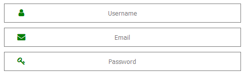
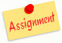

# Een webpagina stylen in CSS

 

**C**ascading **S**tyle **S**heets is een style sheet language die gebruikt wordt om de presentatie van een HTML document te beschrijven.

CSS is ontworpen om het scheiden van presentatie en inhoud van een webpagina mogelijk te maken. Hierdoor is het geheel beter toegankelijk, flexibeler en heeft een een betere controle op de presentatie karakteristieken. Meerdere webpagina's kunnen ook dezelfde opmaak delen door gebruik te maken van eenzelfde .css bestand.

## Verschillende methoden om stijl aan jou html pagina te koppelen

### Inline

Inline opmaak gebeurt binnenin de HTML tags. Elke HTML tag kan voorzien worden van een css opmaak.

```html
<body style="background-color: green">
```

Een groot nadeel is dat je voor de volledige website deze opmaak moet herhalen voor elke HTML tag.
Het is dan ook aangeraden deze methode zo weinig mogelijk te gebruiken!

### Internal

Bij deze methode ga je alle opmaak gaan samenbrengen in een style tag bovenaan de HTML pagina.
```html
<style>
    body {
        background-color: green;
    }
</style>
```
Dit is reeds een stukje beter dan de vorige methode, maar voor verschillende pagina's moet je terug die opmaak gaan kopieren wat de kans op fouten aanzienlijk verhoogd.
Probeer ook deze methode zoveel mogelijk te vermijden tenzij je een one-page-website maakt.

### External

Deze methode gebruikt de informatie die in de style-tag stond bij de internal methode en plaatst deze in een .css bestand.
```css
body {
   background-color: green;
}
```
Dit .css bestand moet dan uiteraard gekoppeld worden aan de HTML pagina.

```html
<link rel="stylesheet" type="text/css" href="/styles/style.css">
```

::: warning 'Good-practice'
Het werken met een external CSS file geniet de voorkeur.
:::

::: tip Tip
Als je meerdere stylesheets wil gebruiken en je html code hiermee niet wil overbelasten kan je de link naar jouw master style.css file in je html code plaatsen en vervolgens in je style.css de andere importeren.

```css
@import "/styles/forms.css"

html {
  background-color: #334455;
}
```
:::

## CSS basis

### Opmaak set

Een CSS opmaak set bestaat uit een selector en een definitie blok:


De selector wijst naar het HTML element dat je wil opmaken.

Het definitie blok bevat één of meerdere, door een puntkomma gescheiden, opmaken.
Elk van die opmaken bevat een CSS eigenschap en de waarde ervan gescheiden door een dubbelpunt.
Elke opmaak staat tussen haakjes.

### Commentaar

In CSS start commentaar met een `/*` en eindigt met `*/`. Commentaar kan gerust over meerdere lijnen lopen.

```css
p {
  color: red;
  /* This is a single-line comment */
  text-align: center;
}

/* This is
a multi-line
comment */
```
### Selector
1. De selector selecteert een HTML element op basis van zijn element naam.

    In dit voorbeeld worden alle `<p>` elementen op de pagina gecentreerd en krijgen een rode tekstkleur:
    ```css
    p {
        text-align: center;
        color: red;
    }
    ```
2. De id selector gebruikt het id attribuut van een HTML element een specifiek element te selecteren.

    Een id van een element is uniek in een pagina, dus het wordt gebruikt om één element te selecteren.
    
    Om een element met een specifiek id te selecteren schrijven we een `#` voor de id naam van dit element:
    ```css
    #para1 {
        text-align: center;
        color: red;
    }
    ```
3. De class selector gebruik het class attribuut van een HTML element op dit te selecteren.

    Om een element met een specifieke class te selecteren schrijven we een `.` voor de class naam van dit element:
    ```css
    .center {
        text-align: center;
        color: red;
    }
    ```
4. Gecombineerde selector

    In dit voorbeeld worden enkel `<p>` elementen met de class="center" van een opmaak voorzien:
    ```css
    p.center {
        text-align: center;
        color: red;
    }
    ```
5. Gegroepeerde selector

    Hier worden alle h1, h2, en p elementen van een opmaak voorzien:
   ```css
    h1, h2, p {
        text-align: center;
        color: red;
    }
    ```

6. Pseudo class selector

    De pseudo class selector zal een toestand of relatie van een element selecteren:
    ```css
    a:hover {
      background-color: green;
      color: white;
    }
    ```
7. Pseudo element selector

    Een deel van een element selecteren:
    ```css
    p::first-line {
      font-size: 12px;
    }
    ```

8. Attribuut selector

    Je kan op basis van attribuut waarde iets selecteren:
    ```css
    input[type=button]{
      color: green;
    }
    ```
### Kleur toepassen

We kennen verschillende manieren om kleur toe te passen in CSS:

1. Via de kleurnaam

    Je kan refereren naar een kleur via zijn naam (<a href="https://www.w3schools.com/colors/colors_names.asp" target="_blank">lijst</a>)

    ```css
    h1 {
        background-color: red;
    }
    ```
2. Via de RGB waarde
 
    Je kan naar een kleur refereren via zijn RBG waarde waarbij elke parameter (rood, groen, blauw) een kleurintensiteit tussen 0 en 255 weergeeft.
    
    ```css
    h1{
        color: rgb(60, 179, 113);
    }
    ```
    Door gebruik te maken van **rgba(rood,groen,blauw,alpha)** kan je transparantheid toevoegen. De alpha parameter is een nummer tussen 0.0 (volledig transparant) en 1.0 (totaal niet transparant)

3. Via de hex waarde

    Je kan naar een kleur refereren via zijn hexadecimale waarde **#rrggbb** waarbij rr(rood), gg(groen) en bb(blauw) hexadecimale waarden zijn tussen 00 en FF.

    bv. #ff0000 is weergegeven als rood omdat rr de waarde FF meekreeg terwijl de andere kleuren een waarde 00 kregen.
    ```css
    table{
        color: #6a5acd;
    }
    ```
4. Via de HSL waarde

    Je kan naar een kleur refereren via zijn tint, verzadiging en helderheid **hsl(hue, saturation, lightness)**

    Hue (tint) is het aantal graden op het kleurenwiel van 0 tot 360 waarbij 0 voor rood staat, 120 voor groen en 240 voor blauw.
    
    Saturation (verzadeging) wordt uitgedrukt in percent waarbij 0% een grijstint is en 100% het volle kleur voorstelt.

    Lightness (helderheid) wordt eveneens in percent uitgedrukt waarbij 0% zwart is en 100% wit.

    ```css
    .card{
        background-color: hsl(39, 100%, 50%);
    }
    ```
    Ook hier kan je gebruik maken van **hsla(hue, saturation, lightness, alpha)** om transparentheid toe te voegen.

Als je een specifiek kleur zoekt kan deze [color picker](https://www.w3schools.com/colors/colors_picker.asp) een handige tool zijn.

### Eenheden

Je kan vrij door elkaar onderstaande eenheden gebruiken:


| Eenheid | Type | Relatie | Voorbeeld |
| --- | --- | --- | --- |
| px | absoluut | scherm pixels | p{font-size: 14px} |
| em | percentage | % van parent element font size | p{font-size: 1.2em} |
| rem | percentage | % van root element font size | p{font-size: 0.75rem} |
| % | percentage | % van parent afmeting of font size | .left {width: 20%} |

## CSS eigenschappen

### Background

Naast het aanpassen van de achtergrond kleur van een HTML element kan je ook een afbeelding laden als achtergrond.

* **background-image** : specificeert de afbeelding die als achtergrond moet gebruikt worden. Standaard wordt deze afbeelding herhaalt over het volledige element.
* **background-repeat** : op welke manier die herhaling moet gebeuren.
* **background-position** : op welke positie die afbeelding moet geplaatst worden.
* **background-attachment** : specificeert of de afbeelding met de pagina moet mee scrollen of vast moet staan.
```css
    body {
        background-image: url("/images/img_tree.png");
        background-repeat: no-repeat;
        background-position: right top;
        background-attachment: fixed;
    }
```

### Border

Met de CSS **border** eigenschap kan je de stijl, dikte en kleur van een border instellen.


```css
    p {
        border-style: solid;
    }
```
### Margin

Met de CSS **Margin** eigenschap kan je afstand creëren rond een element buiten de rand van het element.

```css
p {
  margin-top: 100px;
  margin-bottom: 100px;
  margin-right: 150px;
  margin-left: 80px;
}
/* of via de korte notitie */
p {
  margin: 25px 50px 75px;
}
```
### Padding

De CSS **padding** eigenschap doet net hetzelfde als margin maar dan langs de binnenkant van de rand van een element.

```css
div {
  padding-top: 50px;
  padding-right: 30px;
  padding-bottom: 50px;
  padding-left: 80px;
}
/* of via de korte notitie */
div {
  padding: 25px 50px 75px 100px;
}
```


### Height and width

De CSS **height** en **width** eigenschappen leggen zoals je wel kunt vermoeden de hoogte en breedte van een element vast.

De waarde kan je op `auto` plaatsen of uitdrukken in `pixels` of `%`.

```css
div {
  height: 200px;
  width: 50%;
  background-color: powderblue;
}
```
### Text

Naast de kleur kan van nog meerdere eigenschappen van tekst vastleggen.

```css
h1 {
  color: green;
  text-align: center;
  text-decoration: underline;
  text-transform: capitalize;
  text-indent: 50px;
  letter-spacing: 3px;
  line-height: 1.8;
  word-spacing: 10px;
  text-shadow: 3px 2px red;
  font-family: "Times New Roman", Times, serif;
}
```
::: tip Tip
Gebruik steeds `" "` rond tekst met spacies.
:::

### Links

Een hyperlink kan je als volgt stylen:

```css
/* Niet bezochte link */
a:link {
  color: red;
}

/* Bezochte link */
a:visited {
  color: green;
}

/* Mouse over link */
a:hover {
  color: hotpink;
}

/* Geselecteerde link */
a:active {
  color: blue;
}
```

### Lists

Je kan de lijst markering als volgt aanpassen:

```css
ul.a {
  list-style-type: circle;
}

ul.b {
  list-style-type: square;
}

ol.c {
  list-style-type: upper-roman;
}

ol.d {
  list-style-type: lower-alpha;
}
```

of zelfs een afbeelding als markering gebruiken:

```css
ul {
  list-style-image: url('/images/sqpurple.gif');
}
```

### tables

Je kan de opmaak van je tabel als volgt aanpassen:

```css
table {
  border-collapse: collapse;
  width: 100%;
}

th, td {
  border: 1px solid black;
  height: 50px;
  text-align: center;
  vertical-align: bottom;
  padding: 15px;
}
```

### Display

De CSS **display** eigenschap zal bepalen als en hoe een element getoond wordt.

```css
/*maak een blocklevel element inline*/ 
li {
  display: inline;
}
/*maak een inline element blocklevel*/
span {
  display: block;
}
/*verwijder het element*/
h1.hidden {
  display: none;
}
```

### Max-width

De CSS **max-width** eigenschap stelt een maximum breedte in van een element.

```css
div.ex2 {
  max-width: 500px;
  margin: auto;
  border: 3px solid #73AD21;
}
```

### Float

De CSS **float** eigenschap maakt het mogelijk om een element zwevend op te stellen.

```css
/*afbeelding zwevend aan de rechterzijde*/
img {
  float: right;
}
```
::: tip Tip
Als een float element buiten het parent element komt dan kan je dat verhinderen door `overflow: hidden` toe te voegen aan het parent element.
:::

### Berekeningen

Het kan soms handig zijn dat je ipv een vaste waarde te gebruiken die kan berekenen.

```css
ul {
  border: 3px solid black;
  width: calc(100% - 6px);
}
```

## Responsief webdesign

Als we spreken over responsief dan hebben we het over de aanpassing aan de schermgrootte van de gebruiker.


We maken onze website responsief in 6 stappen:

1. Gebruik enkel em of rem als eenheid.

2. Zorg dat de viewport metatag aanwezig is.

3. Maak je layout flexibel.

    * gebruik flexbox en/of float, zeker geen absolute positionering
    * gebruik min-width en max-width, zeker geen width
    * gebruik % voor kolommen, zeker geen vaste eenheden
    * gebruik geen height voor rijen
    * gebruik width:100% en max-width voor containers en afbeeldingen, zeker geen vaste eenheden.

4. Bepaal je breekpunten waar de overgang plaatsvindt tussen de grote en kleine versie van je pagina.

    Dit kan je best doen door in je browser zelf de schermbreedte aan te passen en te zien wanneer je best overschakelt.

5. Voeg media queries toe

    Stel dat je breekpunten wil op 600px, 800px en 1000px. Start dan met de css voor het kleinste scherm en zo verder tot het grootste scherm.

    ```css
    @media (min-width: 37.5em) { /* 37.5 * 16 = 600px */
      /* extra CSS voor schermen vanaf 600px */
      ...
    }
    @media (min-width: 50em) { /* 50 * 16 = 800px  */
      /* extra CSS voor schermen vanaf 800px */
      ...
    }
    @media (min-width: 62.5em) { /* 62.5 * 16 = 1000px  */
      /* extra CSS voor schermen vanaf 1000px */
      ...
    }
    ```

6. Pas je CSS aan tot het voor alle schermen er goed uit ziet.

## Voorbeeld

::: tip We werken de styling van het voorbeeld uit het hoofdstuk HTML uit



Eerst en vooral moeten we in de HTML code een verwijzing naar onze externe style sheet toevoegen.

```html
<head>
  <!--metadata -->
  <link rel="stylesheet" type="text/css" href="/styles/style.css">
</head>
```
We starten met een achtergrond kleur en tekst stijl te definiëren voor onze html pagina.

```css
html {
    background-color: grey;
    font-family: Calibri;
    color: black;    
}
```
Vervolgens zorgen we er voor dat de body een bepaalde breedte heeft en centraal in de pagina staat. Eveneens zorgen we voor een zekere marge tussen de rand van de body en de inhoud.

```css
body {
    width: 62.5em ;
    margin: auto;
    background-color: floralwhite;
    padding: 1em;    
}
```
Nu definiëren we de algemene opmaak van de verschillende containers vast.
```css
.banner, .actueel, .praatje, .forcast{
    background-color: white;
    padding: 0.5em;
    overflow: hidden;
}
```
Vervolgens definiëren we de opmaak van de verschillende elementen in de banner.
```css
.banner h1{
    font-family: sans-serif;
    font-size: 3em;
    text-align: center;
}

.banner p{
    float: right;
    border: 1px solid gray;
    padding: 0.2em;
    border-radius: 0.2em;
}

.banner a{
    text-decoration: none;
    color: tomato;
}

.banner a:hover{
    color: #006347;
}
```
Nu kijken we voor de stijl van de actueel container en leggen de algemene stijl vast voor `h3`.
```css
.actueel{
    float: left;
    margin-right: 2em;
    width: 35%;    
}

h3{
    font-size: 1.5em;
    color: tomato;
}

.actueel img{
    float: right;
}

ul{
    list-style-type: none;    
}
```
Voor het weerpraatje willen we de afbeelding rechts naast de tekst krijgen.
```css
.praatje img{
    width: 30%;
    float: right;
    margin: 0.1em;
    border: 1px solid black;
    padding: 0.2em;
}
```
De tabel van de weersvoorspelling krijgt ook een mooie opmaak.
```css
table {
    border-collapse: collapse;    
    margin: 2em 0;    
    font-size: 0.9em;
    font-family: sans-serif;
    min-width: 40em;
    box-shadow: 0 0 20px rgba(0, 0, 0, 0.15);
}

th, td {
    text-align: center;
    padding: 0.5em;
}
```
Tot slot zorgen we voor een mooie footer.
```css
.footer{
    color: gray;    
    text-align: right;    
}
```

Proficiat je eerste pagina met stijl is klaar.
:::

## Herhaling via zelfstudie

Om de nieuwe leerstof nog beter te begrijpen kan je onderstaande videotutorial even bekijken:

* [CSS Essential Traininng](https://www.linkedin.com/learning/css-essential-training-3) op LinkedIn Learning

::: tip Taak 2 - Een eenvoudige webpagina met stijl



* [Opdrachtfiche](assignment2.html)
:::

## Het gebruik van online stylesheets

Naast het werken met je eigen stijl kan je ook gebruik maken van online stijlen. 

Bekijk zelf even de mogelijkheden van:

* [Bootstrap](https://www.linkedin.com/learning/bootstrap-4-essential-training)

* [Font Awesome](https://www.youtube.com/watch?v=rXiO4bm2Zpc)

::: tip Taak 3 - Een eenvoudige webpagina met online stijl


* [Opdrachtfiche](assignment3.html)
:::

## Cheatsheet

[Hier](/files/cheatsheet_css.pdf) kan je een cheatsheet terugvinden ter ondersteuning van taken, toetsen, projecten en werkplekleren.