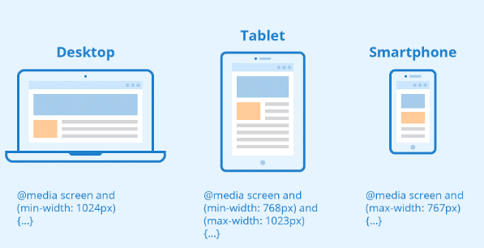
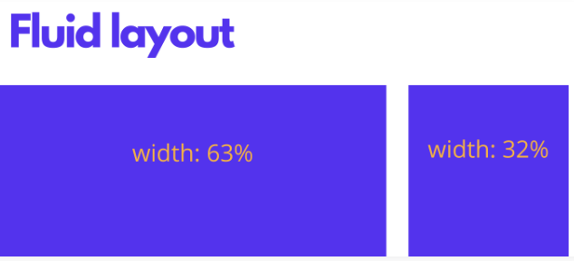
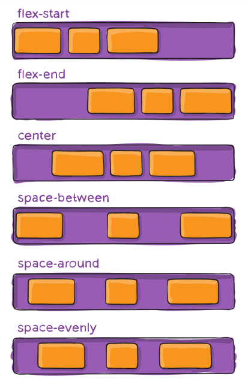
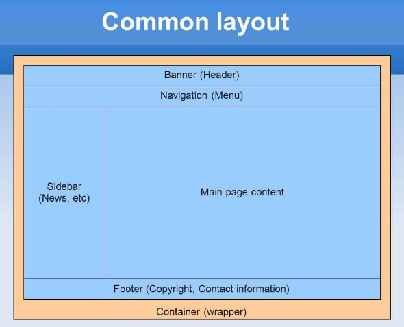

# Een webpagina voor iedereen

Responsive design is een methode binnen webdesign die ervoor zorgt dat je webcontent meeverandert met de verschillende afmetingen van schermen van apparaten of vensters op die apparaten.

Zo kan je content op een desktopscherm bijvoorbeeld worden gesplitst in verschillende kolommen, aangezien zo’n scherm breed genoeg is om meerdere kolommen leesbaar weer te geven.

Maar als je dezelfde content in meerdere kolommen op een smartphone wil tonen, kan dit er voor zorgen dat de content voor de bezoekers lastig leesbaar is.

Responsive design maakt het mogelijk om verschillende lay-outs van je content en bijbehorend design af te leveren aan verschillende apparaten, afhankelijk van hun schermgrootte.

### De bouwstenen van responsive webdesign

In dit deel zullen we het hebben over de fundering van responsive webdesign en de verschillende bouwstenen die je daarvoor nodig hebt.

#### CSS en HTML

De basis voor responsive design is de juiste combinatie van HTML en CSS

Zo kan je bijvoorbeeld de breedte van alle HTML afbeeldingen aanpassen per element, op deze manier:

```css
img {
  width: 100%;
}
```

Of we kunnen ons juist richten op een specifieke class, “full-width-img” door vooraf een punt toe te voegen.

```css
.full-width-img {
  width: 100%;
}
```

Je kan het ontwerp ook op andere aspecten bewerken, naast hoogte, breedte en kleur. Door CSS op deze manier te gebruiken maak je een ontwerp responsive, zodra je het combineert met een techniek die “media query” wordt genoemd.

#### Media query’s

Een media query controleert welk apparaat wordt gebruikt en is een belangrijk deel van CSS3. Het is namelijk het onderdeel waarmee je content kan laten weergeven afhankelijk van bepaalde factoren, zoals schermgrootte of resolutie.



Je kan het vergelijken met een “if” clausule die je kan vinden in sommige programmeertalen, aangezien het eigenlijk controleert of het zichtbare deel van een scherm breed genoeg of te breed is, voordat een bepaald stuk code wordt uitgevoerd.

```css
@media screen and (min-width: 780px) {
  .full-width-img {
    margin: auto;
    width: 90%;
  }
}
```

Is het scherm tenminste 780 pixels breed, dan zullen afbeeldingen met de “full-width-img” class 90% van het scherm gebruiken en automatisch gecentreerd worden in gelijke marges aan beide kanten.

#### Fluid lay-outs

Een fluid lay-out (vloeiende lay-out) is een essentieel onderdeel van modern responsive design. In de goede oude tijd kon je een statische waarde voor elke HTML element instellen, bijvoorbeeld 600 pixels.

Een fluid lay-out is echter afhankelijk van dynamische waardes, zoals een percentage van de breedte van het scherm.



Deze methode past dynamisch de grootte van elementen aan op basis van de grootte van het scherm.

#### Flexbox lay-outs

Alhoewel een op percentages gebaseerde lay-out wordt gezien als ‘fluid’, vinden veel designers en webdevelopers dit nog niet dynamisch of flexibel genoeg. Flexbox is een CSS module die is ontworpen als efficiëntere manier om diverse elementen in een lay-out te plaatsen, zelfs wanneer de grootte van de inhoud van een container niet bekend is.

Een flexibele container past de items in de container aan naar gelang de beschikbare ruimte. Deze flex containers hebben een aantal unieke property’s, zoals justify-content, die je niet kan aanpassen bij een normaal HTML element.



Dit is vrij geavanceerd design. Als je dit in je design wil gaan toepassen, raden we je aan om de [CSS Tricks’ flexbox gids](https://css-tricks.com/snippets/css/a-guide-to-flexbox/) te lezen.

#### Responsive afbeeldingen

De meest basale uitvoering van responsive afbeeldingen volgt hetzelfde concept als fluid lay-out, waarbij een dynamische unit wordt gebruikt om de breedte of hoogte in te stellen. Het stukje CSS code dat we eerder al noemde, zorgt hier al voor:

```css
img {
  width: 100%;
}
```

De % unit schat een percentage in van de breedte of hoogte van de viewport en zorgt dat de afbeelding de juiste verhouding heeft voor het scherm.

Het probleem met deze aanpak is dat elke gebruiker de afbeelding op ware grootte moet downloaden, zelfs op mobiele apparaten.

Om verschillende versies voor verschillende apparaten te kunnen leveren, moet je het HTML `srcset` attribuut in je img tags opnemen, zodat je meer dan één afbeeldingsgrootte kan kiezen.

```html

```

### Gebruikelijke limieten voor responsiviteit

Om met media query’s te werken, moet je nadenken over “responsive breakpoints” oftewel limieten voor schermgroottes. Een limiet of breakpoint is de breedte van het scherm waarop je een bepaalde media query gebruikt om nieuwe CSS stijlen te implementeren.

### Gebruikelijke schermgroottes

* Mobiel: 360 x 640
* Mobiel: 375 x 667
* Mobiel: 360 x 720
* iPhone X: 375 x 812
* Pixel 2: 411 x 731
* Tablet: 768 x 1024
* Laptop: 1366 x 768
* High-res laptop of desktop: 1920 x 1080

Kies je voor een mobile-first aanpak, met één kolom en kleinere lettertypen dan de basislay-out, dan hoef je geen mobiele limieten te implementeren, tenzij je het ontwerp wil optimaliseren voor specifieke modellen.


Je kan zodoende een eenvoudig responsive ontwerp maken met slechts twee limieten: één voor tablets en één voor laptops en desktops.

### Zo maak je je website responsive

Nu je de bouwblokken kent, is het tijd om je website responsive te maken.

#### Stel de limieten van je media query in (responsive breakpoints)

Stel de limieten van je media query in op de unieke eisen van je ontwerp. Wil je bijvoorbeeld de Bootstap standaard volgen binnen je ontwerp, dan krijg je de volgende media query’s:

* 576px voor verticale telefoons
* 768px voor tablets
* 992px voor laptops
* 1200px voor grotere apparaten

#### Stel de grootte van elementen in met percentages of maak een CSS Grid lay-out

De eerste en belangrijkste stap is het instellen van verschillende groottes voor de verschillende elementen in de lay-out, afhankelijk van de media query of het limiet van het scherm.

Het aantal lay-out containers dat je hebt, hangt natuurlijk af van je ontwerp, maar de meeste websites focussen op de elementen hieronder:

* Wrapper of container
* Header
* Content
* Zijbalk
* Footer



Met een mobile-first aanpak, kan je eerst de belangrijkste elementen in de lay-out stylen (let op: bevat geen media query voor de eenvoudigste stijl die je gebruikt voor een standaard smartphone in normale stand):

```css
#wrapper {width:95%;  margin: 0 auto; }
#header {width:100%; }
#content {width:100%; }
#sidebar {width:100%; }
#footer {width:100%; }

// Small devices (landscape phones, 576px and up)

@media (min-width: 576px) { ... }

// Medium devices (tablets, 768px and up)

@media (min-width: 768px) {
  #wrapper {width:90%;  margin: 0 auto; }
  #content {width:70%; float:left; }
  #sidebar {width:30%; float:right; }
}

// Large devices (desktops, 992px and up)

@media (min-width: 992px) { ... }

// Extra large devices (large desktops, 1200px and up)

@media (min-width: 1200px) {
  #wrapper {width:90%;  margin: 0 auto; }
}
```

Ga je liever voor percentages, dan beheerst het “float” attribuut aan welke kant van het scherm een element verschijnt: links of rechts.

Wil je verder dan de basis gaan en een responsive design van topkwaliteit maken, dan zul je de CSS flexbox lay-out onder de knie moeten krijgen, inclusief bijbehorende attributen zoals box-sizing en flex.

#### Implementeer responsive afbeeldingen

Een manier om ervoor te zorgen dat er niks misgaat met je afbeeldingen, is het gebruiken van een dynamische waarde voor je afbeelding, zoals we eerder al zagen.

```css
img {
  width: 100%;
}
```

Maar hiermee vraag je nog steeds vrij veel van mobiele bezoekers wanneer ze je website bezoeken.

Let erop dat je altijd een `srcset` gebruikt met verschillende afmetingen van je afbeeldingen, voordat je afbeeldingen toevoegt aan je pagina’s.

Om dit handmatig te doen kost nogal wat tijd, maar met een CMS zoals WordPress wordt dit automatisch gedaan wanneer je mediabestanden uploadt.

#### Responsive lettertypen voor de tekst van je website

De belangrijkste focus van responsive webdesign richt zich vaak op de responsiviteit van de lay-outblocks, elementen en media. Pas daarna denken mensen (misschien) nog eens aan de tekst.

Maar wil je écht goed responsive ontwerp, dan moet je ook de grootte van je lettertype aanpassen zodat deze zich aanpast aan de schermgrootte.

De makkelijkste manier om dit te doen is het instellen van een statische waarde voor de grootte van lettertype, zoals 22 px, en die voor elke media query aan te passen

Je kan tegelijkertijd meerdere tekstelementen targeten door een komma te gebruiken om elementen in een lijst te zetten.

```css
@media (min-width: 992px) {
  body, p, a, h4 {
    font-size: 14px;
  }
}
```

## Cross-browser webdesign

De websites die je maakt, moeten er geweldig uitzien en een sterke indruk achterlaten bij klanten en gebruikers, ongeacht of ze Opera, Chrome, Safari of iets anders gebruiken.

Cross-browser compatibiliteit is een stap die vaak over het hoofd wordt gezien bij het maken van een nieuwe website. Vaak gebruiken de ontwerpers en ontwikkelaars maar één browser om de site te maken en ze controleren hem misschien snel op een handvol andere browsers voordat ze het project als voltooid beschouwen. Dit kan voldoende zijn voor eenvoudige sites die niet bedrijfskritisch zijn, maar als je complexere sites bouwt, kan jouw site er heel anders uitzien op andere browsers.

Natuurlijk is het testen van elke pagina op elke verschillende combinatie van apparaat, platform en browser bijna onmogelijk, en erg kostbaar. Hoe kunnen we er dan voor zorgen dat onze site er op zoveel mogelijk browsers zo uitziet en zich zo gedraagt als we voor ogen hebben?


### Cross-browser compatibiliteit in de hand werken

#### Herhaal jezelf niet

Bij het ontwikkelen van code werk je zoveel mogelijk met externe bestanden voor gelijke code en herhaal je de code niet over en over.
Op die manier moet je bij problemen slechts op één plaats aanpassingen doorvoeren.

#### Definieer een doctype

Aan het begin van je HTML-bestand(en) definieer je de taal waarin de code is geschreven, zodat browsers het correct interpreteren. Bijvoorbeeld, in HTML5 is de doctype declaratie eenvoudigweg:

```html
<!DOCTYPE html>
```

#### Valideer uw code

Foutieve HTML- en CSS-code kan ervoor zorgen dat je website zich in alle browsers op verschillende manieren misdraagt. De bugs kunnen moeilijk te ontdekken zijn en de webpagina zal nog steeds typisch opgebouwd worden met kleine, schijnbaar willekeurige problemen wat het op zijn beurt moeilijk maakt om te debuggen.

Een manier om dit te vermijden is uw code te valideren. Je kunt [HTML](https://validator.w3.org/#validate_by_input+with_options) en [CSS](https://jigsaw.w3.org/css-validator/#validate_by_input) valideren met de W3C validators, of extensies installeren in je IDE die je code controleren terwijl je hem schrijft.

#### Gebruik een CSS reset

Standaard kunnen browsers hun eigen standaard stijlen toepassen op uw website. Chrome past bijvoorbeeld een standaardmarge toe op uw pagina, deze is klein, maar merkbaar als u een donkerdere achtergrondkleur gebruikt.

```css
/*  CSS resetcode */
html, body, div, span, applet, object, iframe,
h1, h2, h3, h4, h5, h6, p, blockquote, pre,
a, abbr, acronym, address, big, cite, code,
del, dfn, em, img, ins, kbd, q, s, samp,
small, strike, strong, sub, sup, tt, var,
b, u, i, center,
dl, dt, dd, ol, ul, li,
fieldset, form, label, legend,
table, caption, tbody, tfoot, thead, tr, th, td,
article, aside, canvas, details, embed, 
figure, figcaption, footer, header, hgroup, 
menu, nav, output, ruby, section, summary,
time, mark, audio, video {
  margin: 0;
  padding: 0;
  border: 0;
  font-size: 100%;
  font: inherit;
  vertical-align: baseline;
}
```

#### Controleer de ondersteuning voor uw CSS eigenschappen

Verschillende browsers ondersteunen niet allemaal dezelfde CSS eigenschappen, wat perfect bruikbaar is in de ene browser bestaat misschien niet in de andere. Bijvoorbeeld, de backdrop-filter eigenschap wordt volledig ondersteund door Chrome, maar is onbestaande in Firefox. Als je erop vertrouwt, dan zal het onverwacht gedrag voor jouw Firefox-gebruikers zijn.

Met tools zoals [Can I Use](https://caniuse.com/) kan je CSS-eigenschappen controleren op hun browserondersteuning. Dit betekent dat je niet veel tijd zult verspillen aan het ontwerpen met een slecht ondersteunde eigenschap, alleen om het later opnieuw te moeten ontwikkelen.

#### Maak responsieve websites

Responsive webdesign zorgt ervoor dat het ontwerp zich aanpast aan elk apparaat waarop het kan worden bekeken, van desktop tot mobiel en alles daartussenin. Het is belangrijk om ervoor te zorgen dat alle functionaliteit mogelijk is en dat alle informatie toegankelijk is op elk apparaat en elke browser, ongeacht de grootte.

#### Zorg voor alternatieven

Er kunnen gevallen zijn waarin we niet kunnen vermijden een eigenschap te gebruiken die niet volledig wordt ondersteund door andere browsers. In dat geval kan het nodig zijn om een alternatief bestand aan te bieden voor specifieke browsers. Bijvoorbeeld:

```html
<link href=”styles.css” rel=”stylesheet”/>
<!--[if lte IE 8]>
 <link href=”ie-styles.css” rel=”stylesheet”/>
<![endif]-->
```

#### Maak gebruik van cloudgebaseerde browsertests

In een ideale wereld zou je in staat zijn om jouw website op veel verschillende apparaten en browsers persoonlijk te testen. Maar in kleinere teams is dit misschien niet mogelijk, dus zou je kunnen kijken naar cloudgebaseerde browsertests waarbij jouw website tegelijkertijd op veel verschillende combinaties van browsers kan worden uitgevoerd. [LambdaTest](https://www.lambdatest.com/),[BrowserStack](https://www.browserstack.com/) en [SmartBear](https://smartbear.com/ppc/testcomplete/web-testing/) bieden allemaal de mogelijkheid om cross-browser compatibiliteit snel en efficiënt te testen.


## Oefening

::: tip Responsief webdesign oefening

Maak de oefening op het elektronisch leerplatform en laad die op.

:::

## Take-home opdracht

::: tip Herhaling Responsief webdesign

Om de nieuwe leerstof nog beter te begrijpen volg je onderstaande videotutorial:

* [The Beginner’s Guide to Responsive Web Design](https://www.youtube.com/watch?v=ACZgsnJIKxc) op YouTube.

Na het volgen van deze online cursus vul je het vragenformulier in op Toledo.

:::
