# Het gebruik van javascript in web development

 

**JavaScript** (JS) is een lichtgewicht, geïnterpreteerde programmeertaal met eersteklas functies. Hoewel het beste bekend als de scripttaal voor web pagina's, wordt het ook door vele niet-browser omgevingen gebruikt, zoals node.js. 

De standaard voor JavaScript is ECMAScript. Met de ingang van 2012, ondersteunen alle moderne browsers volledig ECMAScript 5.1. Op 17 juni 2015, publiceerde ECMA International de zesde hoofdversie (major version) van ECMAScript, dit heet officieel ECMAScript 2015, en wordt in het algemeen vaker aangeduid als ECMAScript 2015 of ES2015. Sindsdien worden de ECMAScript standaarden op jaarlijkse basis vrijgegeven.

Verwar JavaScript niet met de Java programmertaal. Beiden "Java" and "JavaScript" zijn handelsmerken of geregistreerde handelsmerken van Oracle in de VS en andere landen. Daarentegen hebben de twee programmeertalen hele verschillende syntaxis, semantiek en toepassingen.

Javascript zorgt ervoor dat je een webpagina **dynamisch** kan maken. Elke actie die moet gebeuren verloopt via een **script** en wordt door de browser, dus aan de **client-side**, verwerkt.

We raden jullie volgend ondersteunend leermateriaal aan:

* Ferguson, R. (2019). Beginning JavaScript: The Ultimate Guide to Modern JavaScript Development. [Link](https://limo.libis.be/primo-explore/fulldisplay?docid=TN_springer_s978-1-4842-4395-4_313453&context=PC&vid=VIVES_KATHO&search_scope=ALL_CONTENT&tab=all_content_tab&lang=nl_BE:) (je moet eerst inloggen via [limo](http://limo.libis.be/index.html#/vives) voor je deze link kan gebruiken)

* [Mozilla developer pagina](https://developer.mozilla.org/en-US/docs/Web/JavaScript)

* [LinkedIn Learning](https://www.academicsoftware.eu/) via Academic Software (kies voor Web Platform)

## We bestuderen enkele voorbeelden

Als je javascript ontwikkeld is het goed om de ontwikkelomgeving (F12) in Chrome te openen en de console in het oog te houden voor foutmeldingen.

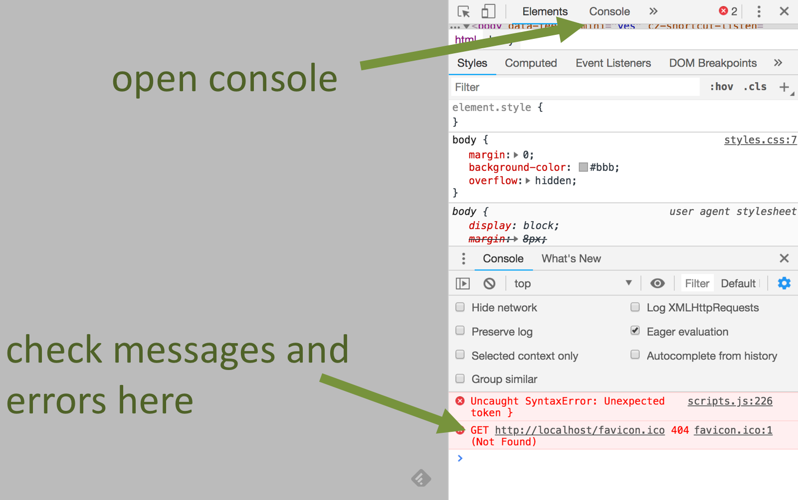

### Content aanpassen

Je kan javascript gebruiken om de inhoud van een element aan te passen.

Maak het bestand **index.html** aan
```html
<!DOCTYPE html>
<html>
    <head>
        <meta charset="utf-8">
        <title>tekst aanpassen</title>
    </head>
    <body>
        <h1 id="head1">Originele titel</h1>
        <form>
            <input type="button" value="Naar nieuw!" onclick="changeTitle()">
            <input type="button" value="Naar oud!" onclick="goBackTitle()">
        </form>
        <script src="script.js"></script>
    </body>
</html>

```
Maak het bestand **script.js** aan
```js
function changeTitle() {
    document.getElementById("head1").textContent="Nieuwe titel";
}
function goBackTitle() {
    document.getElementById("head1").textContent="Originele titel";
}
``` 

* met de syntax `document.getElementById()` gaan we in de HTML pagina op zoek naar het element met de Id = ... 
* met de syntax `.textContent` gaan we de inhoud van dit element gaan aanpassen.

::: danger Waarschuwing
Gebruik nooit de syntax `.innerHTML`, het houd enorme **security risico's** in!
:::

### Style aanpassen

Je kan javascript gebruiken om de opmaak van iets aan te passen.

Maak het bestand **index.html** aan
```html
<!DOCTYPE html>
<html>

<head>
  <meta charset="utf-8">
  <title>Achtergrondkleur aanpassen</title>
</head>

<body id="body1">
  <form action="">
    <input type="button" value="BG-COLOR" onclick="changeBackground2()">
  </form>
  <script src="script.js"></script>
</body>

</html>
```
Maak het bestand **script.js** aan
```js
let bgcolors = ["#FF00FF", "#00FFFF", "#0000FF", "#FFFFFF", "#FF0000", "#00FF00"];
let bgcolors_tel = 0;
function changeBackground2() {
    document.getElementById("body1").style.backgroundColor = bgcolors[bgcolors_tel];
    bgcolors_tel++;
    if (bgcolors_tel == bgcolors.length) {
        bgcolors_tel = 0;
    }
}
```
* met de syntax `.style` kan je de stijl van  een element aanpassen.

### Complete style aanpassen

Je kan javascript gebruiken om de volledige opmaak van je pagina, zeg maar het thema, te wijzigen.

Maak het bestand **index.html** aan
```html
<!DOCTYPE html>
<html>

<head>
  <meta charset="utf-8">
  <link id="cssFile" rel="stylesheet" type="text/css" href="css1.css">
  <title>Achtergrondkleur aanpassen</title>
</head>

<body>
  <form action="">
    <input type="radio" name="whichCSS" value="css1" onchange="changeCSS()" checked="true">css1<br>
    <input type="radio" name="whichCSS" value="css2" onchange="changeCSS()">css2<br>
    <input type="radio" name="whichCSS" value="css3" onchange="changeCSS()">css3<br>
  </form>
  <script src="script.js"></script>
</body>

</html>
```

Maak het bestand **css1.css** aan
```css
body {
    background-color: lightblue;
  }
```
Maak het bestand **css2.css** aan
```css
body {
    background-color: lightgreen;
  }
```
Maak het bestand **css3.css** aan
```css
body {
    background-color: lightyellow;
  }
```
Maak het bestand **script.js** aan
```js
function changeCSS() {
    let whichCSS = document.getElementsByName("whichCSS");
    if(whichCSS[0].checked==true) {
        document.getElementById("cssFile").setAttribute("href","css1.css");
    }
    if(whichCSS[1].checked==true) {
        document.getElementById("cssFile").setAttribute("href","css2.css");
    }
    if(whichCSS[2].checked==true) {
        document.getElementById("cssFile").setAttribute("href","css3.css");
    }
}
```

## Vertrouwd raken met de syntax

Voor eerst moet je begrijpen dat javascript lijn per lijn geïnterpreteerd wordt door de browser. Terwijl je bij c# het programma compileert tot machinetaal instructies en dan zelfstandig kan laten runnen.

### Javascript toevoegen aan je html pagina.

Je kunt ervoor kiezen om een script block toe te voegen aan je html pagina. Indien mogelijk vermijd je deze techniek.

```html
<body>
    <script type="text/javascript">
        // hier komt dan de java code
    </script>
</body>
```
Of je kan terug met een aparte file werken, wat de voorkeur geniet.

```html
<body>
    <!-- hier komt de volledige body van de html pagina -->

    <script src="/scripts/script.js"></script>
</body>
```

::: tip Tip
Voeg je script steeds **onderaan je body** toe, zo krijgt de gebruiker je webpagina reeds te zien terwijl het script nog aan het laden is bij een trage internetverbinding.

Als je in javascript andere javascripts gebruikt moet je die voor jou script link plaatsen in de body.
:::

### De console als debug tool

Je kan de console van je browser gebruiken als debug tool door er informatie naar te sturen.

```js
let school = 'Vives';
console.log('school = ' + school);
```

Je kan tevens javascript uittesten in de console voor je het gaat toevoegen aan je script.

### Variabelen

In javascript zijn variabelen 'loosely typed', wat wil zeggen dat het datatype afhankelijk is van wat je in de variabele stopt. Je kan dus perfect het ene moment een integer in een variabele hebben en enkele ogenblikken later een string in diezelfde variabele hebben.

**Let**
```js
let y = 13
```
Let is een variabele definitie die enkel geldig is binnen de block-scope `{}` waarin hij is gedefinieerd.

**var**
```js
var y = 12
```
Var is een algemene variabele definitie, als je die dus binnen een functie definieert is de functie de scope van de variabele, als je die bovenaan plaatst wordt de volledige script-file de scope.

**const**
```js
const y = 11
```
Const is de definitie van een constante, heeft dezelfde scope als let maar je kan de waarde niet aanpassen.

::: warning Aandacht
Als je een variable definieert zonder let, var of const dan is dit automatisch een globale variabele. Je moet dan ook goed opletten dat je nergens anders een variabele definieert met dezelfde naam.

Om te vermijden dat je die let, var of const per ongeluk zou vergeten kan je bovenaan je script file "use strict"; plaatsen. Je krijgt dan een foutmelding als je het vergeet.

```js
'use strict';

let somevariable;
```
:::

### Datatypes

Binnen javascript worden 7 primitieve datatypes gebruikt:
* Boolean : true of false
* Number : integer of float
* BigInt : een integer met onbeperkte grootte, te herkennen aan een kleine n na het getal bv `23232n`
* String : tekst
* Undefined : het datatype is nog niet gedefinieerd bv `let a;`
* Null : om een speciale waarde 'null' aan te geven
* Symbol : elke instantie is uniek, bv `Symbol("description");`

Daarnaast heb je nog het object type die gebruikt kan worden om een verzameling van waarden te bewaren.
```js
let obj = {name: 'Piet', age : 5};
```
Er zijn nog 4 speciale object type:
* Function
* Array
* Date
* RegExp

Laten we dit even bekijken in de console van chrome. Start Chrome op en ga naar  `about:blank` om een lege webpagina te krijgen. Druk vervolgens op F12 en ga naar de console.

```js
let n=5   // het resultaat is 5
n = 0xF   // het resultaat is 15 (hexadecimaal getalstelsel)
n = 015   // het restulaat is 13 (octaal getalstelsel)

'5'== 5   // het resultaat is true (== kijkt niet naar het datatype)
'5'===5   // het resultaat is false (==== doet dat wel)

let myString = "Hello World";
myString.length         // het resultaat is 11
myString.toUpperCase()  // het resultaat is HELLO WORLD

// ook hier kan je \n en \t gebruiken voor nieuwe lijn of tab

`value of n is ${n}`    // geformateerde string
n.toString()            // datatype conversie

let obj = { name: 'Carrot', for: 'Max', details: { color: 'orange', size: 12}};
obj.name                // het resultaat is Carrot

let obj2=obj            // let op is geen kopie maar een 2de verwijzing naar hetzelfde object
obj2.name = 'Apple'     // dit zal dus bij beide objecten de name wijzigen naar Apple.

let a = { x: {z:1} , y:2};
let b = JSON.parse(JSON.stringify(a)); // dit zorgt voor een deepcopy van het object, dit zijn dus twee verschillende objecten.

let myArray = [];
myArray = [5,'Hello',{name:'Piet'}];
myArray[1];             // Het resultaat is Hello, een array start steeds op positie 0
myArray[10]='hi';       // Voegt een nieuw item toe op positie 10 maar zal ook tussen positie 2 en 10 lege plaatsen aanmaken
myArray.push('Test');    // Zal een nieuw item achteraan de array toevoegen.
myArray.pop();           // Zal het laatste item van de array verwijderen
```

### Logische operatoren

We kunnen in javascript de gekende logische operatoren gebruiken om condities te  bouwen:

* `&&` de EN operator
* `||` de OF operator
* `!` de NIET operator

Bijzonder bij de interpretatie van condities is dat javascript de conditie bekijkt tot de uitkomst met zekerheid vastligt, de rest van de conditie wordt op dat ogenblik niet meer geinterpreteerd.
```js
false && (a=2)  // linker deel is false, dus de conditie is false, a=2 zal niet meer uitgevoerd worden.
```
### Beslissingen

We kunnen in javascript de gebruikelijke beslissingsstructuren gebruiken:

```js
if(...){
  // code
}
else if(...){
  // code
}
else {
  // code
}

switch(answer){
  case "YES":
    // code
    break;
  default:
    // code
    break;
}
```
Daarnaast hebben we ook de ternary operator:
```js
(animal === 'cat') ? console.log("cat") : console.log("no cat");
```
### Herhalingen

We kunnen in javascipt ook met lussen werken:

```js
// for lus
for (let i=0; i<10; i++){}
// for-of lus
let names = ['Piet','Jan','Pol'];
for (let name of names) {
   	console.log(name);
};
// for-in lus
let names = {n1:'Piet',n2:'Jan',n3:'Pol'};
for (let i in names) {
   	if(names.hasOwnProperty(i)) console.log(names[i]);
};
// while lus
let count = 5;
while (count > 0){
  console.log(count);
  count--;
}
//do-while lus
let count = 5;
do {
  console.log(count);
  count--;
} while (count > 0);
```
### Functies

We kunnen in javascript eveneens met methoden en functies werken:
```js
// methode
function sayMessage(message){
   if(typeof(message)==='string') console.log(message);
}
// functie
function isEven(n) {
  return ((n%2)===0); 
}
// oproepen van de functie
let even=isEven(10);
```
Daarnaast kunnen we hier eveneens met parameters werken:
```js
// functie met default parameters
function sayMessage(message, times){
  times=(typeof(times)!=='undefined') ? times:10;
  if(typeof(message)==='string'){
    for(let i=0;i<times;i++) console.log(message);
  }
}
// functie met het aantal parameters naar keuze, parameters komen in de array 'arguments'
function sayMessages(){
  for (let i=0; i< arguments.length; i++) console.log(arguments[i]);
}
```
Het doorgeven van parameters werkt hier eveneens op het principe van 'pass by value', d.w.z. dat de waarde van tijdelijk wordt gekopierd naar een lokale variabele. Dat is echter niet het geval voor reference variablen zoals bv een object. daar geld het principe van 'pass by reference' en is er sprake van een tijdelijke variabele die verwijst naar de originele.

```js
// pass by value voorbeeld
let boodschap='hi';
function changeMessage(message){
  message="test";
}
changeMessage(boodschap);
console.log(boodschap);    // het resultaat is 'hi'

// pass by reference voorbeeld
let obj={msg:'hi'};
function changeMessage(message){
  message.msg="test";
}
changeMessage(obj);
console.log(obj.msg);   	// het resultaat is 'test'
```

Verder kan je creatief omgaan met functies.

```js
// een functie als een variabele
let sayMessage= function(message){ console.log(message); }
// een functie meegeven als een parameter
window.setTimeout(sayMessage,5000,'Hi');
// een functie als deel van een object
let obj= { f: function(message){ console.log(message); } };
obj.f('Hi');
// een anonieme functie ( die heeft geen naam)
nummers.forEach( function(i) {console.log("array bevat ",i);})
// een arrow functie
verdubbel = i => (i*2);
```
Een functie die meegeven wordt als parameter met een andere functie noemen we een **'callback functie'**.

### Error afhandeling

Net zoals in C# kan je met `try` en `catch` de error afhandeling voorzien.

```js
try {
  // hier komt de code die je wil uitvoeren
} catch (e){
  console.warn(e); // als er een fout optreed zal deze naar de console worden gestuurd.
}
```

### Commentaar voorzien

Zoals steeds is het 'good-practice' om je code van commentaar te voorzien.

```js
/**
  * Een blok aan commentaar
  * over meerdere lijnen
  */

// Commentaar op 1 enkele lijn.
```

### HTML elementen vinden

Om in javascript elementen van een html pagina op te vragen bestaan er enkele mogelijkheden:

* getElementById() : één element met een bepaald id
* getElementByName() : lijst van elementen met een bepaalde naam
* getElementByTagName() : lijst van een bepaald type elementen
* querySelectorAll() : lijst van elementen die voldoet aan een CSS selector
* querySelector() : eerste element die voldoet aan een CSS selector

### Good practices

* Als je manuele indentatie voorziet, gebruik dan steeds ofwel spaties ofwel tabs maar combineer ze niet.
* Voorzie je code van commentaar zodat je code vlotter begrijpbaar is.
* Plaats spaties:
  * na een `,`, `:`, `;` maar niet er voor
  * na een `if`, `for`, `while` en `function`
  * voor en na een operator (`==`, `<`, `&&`, `+`, ...)
* Vermijd het gebruik van `var` om een variabele te definiëren

### Herhaling via zelfstudie

Volg onderstaande videotutorials van LinkedIn Learning op je eigen tempo tegen de volgende les:

* [Learning the javascript Language](https://www.linkedin.com/learning/learning-the-javascript-language-2) (Hoofdstuk 7 is optioneel)
* [Using input validation](https://www.linkedin.com/learning/validating-and-processing-forms-with-javascript-and-php) (Hoofdstuk 1 t.e.m. 3)

## JavaScript Object Notation (JSON)

 

JSON is een formaat om op eenvoudige en compacte manier data te kunnen uitwisselen. Er zijn 2 structuren, objecten te herkennen aan {} en array’s te herkennen aan [].


```json
{
  "my_name": "Piet",
  "my_number": 23,
  "my_object": {
    "my_array": [
      5,
      6,
      7
    ]
  }
}
```

Om een JSON string om te zetten naar een JSON object gebruik je de .parse() methode. 

Test dit even uit in de console:
```js
const json = '{"result":true, "count":42}';
const obj = JSON.parse(json);
```

**Merk op** dat bij een combinatie van “, je hier best de buitenste aanpast naar ‘.

Om een JSON object om te zetten naar een string gebruik je de .stringify() methode.

Test dit even uit in de console:
```js
console.log(JSON.stringify({ x: 5, y: 6 }));
// expected output: "{"x":5,"y":6}"
```

## Nog even verder oefenen

We oefenen javascript verder in a.d.h.v. twee oefeningen.

### Een rekenmachine via javascript

Om javascript nog verder in te oefenen maken we een rekenmachine als voorbeeld.

Om een pagina te stylen en er terzelfdertijd voor te zorgen dat die responsief is kunnen we volgende technieken gebruiken:

* Block : line breaks voor en na
* Inline : zonder line breaks, op de zelfde lijn als er plaats is
* Grid : volgens het grid model
* Flex : volgens het flex model

Meer informatie is terug te vinden op [Mozilla Developer](https://developer.mozilla.org/en-US/docs/Learn/CSS/CSS_layout)

In dit voorbeeld zullen we gebruik maken van het **grid model**.

Meer informatie over het grid model kan je terugvinden op [Mozilla Developer](https://developer.mozilla.org/en-US/docs/Web/CSS/CSS_Grid_Layout/Basic_Concepts_of_Grid_Layout)

We bouwen als eerst onze html pagina, als leidraad nemen we het numeriek klavier van ons toetsenbord.

```html
<!DOCTYPE html>
<html>
    <head>
        <meta charset="UTF-8">
        <title>Rekenmachine</title>
        <link rel="stylesheet" href="styles.css">
        <meta name="viewport" content="width=device-width, initial-scale=1">
    </head>
    <body>
        <div class="wrapper">
            <div id="display"></div>
            <button id="CE">CE</button>
            <button>/</button>
            <button>*</button>
            <button>-</button>   
            <button>7</button>
            <button>8</button>
            <button>9</button>
            <button class="h2">+</button>
            <button>4</button>
            <button>5</button>
            <button>6</button>
            <button>1</button>
            <button>2</button>
            <button>3</button>
            <button id="equal" class="h2">=</button>
            <button class="w2">0</button>
            <button>.</button>          
        </div>
        <script src="script.js"></script>
    </body>
</html>
```
We kennen id's toe waar we interactie willen of de toetsen afwijken van de normale grootte.

Vervolgens brengen we de styling van onze pagina in orde. We maken hierbij gebruik van het grid model.

```css
.wrapper {
    display: grid;
    grid-template-columns: repeat(4, 1fr);
    max-height: 400px;
    max-width: 400px;
    font-size: 40px;
}

button {
    font-size: 40px;
}

#display {
    grid-column: span 4;
    text-align: right;
}

.h2 {
    grid-row: span 2;
}


.w2 {
    grid-column: span 2;
}
```
Nu kunnen we starten aan het javascript.
Omdat we willen dat de gebruiker zo snel mogelijk interactie kan hebben wachten we niet op het laden van figuren of style. Dit kunnen we doen d.m.v. het 'DOMContentLoaded' event.

Laten we reeds starten met ons script:

```js
window.addEventListener('DOMContentLoaded', (event) =>
{
    console.log("dom geladen");

    let buttonClick = (event) => {

        document.getElementById("display").textContent+=
        event.target.textContent;}
    
    document.querySelectorAll(".wrapper button").forEach(
        (element) => element.onclick=buttonClick
    );   
});
```
We kunnen dit even uittesten, als je op een toets klikt zal de inhoud ervan toegevoegd worden aan het display.

Om wat we ingebracht hebben te kunnen evalueren zouden we gebruik kunnen maken van de functie `eval`. Laten we dit even proberen :
```js
document.getElementById("equal").onclick=(event) => {
        document.getElementById("display").textContent =
        eval(document.getElementById("display").textContent);        
    }        
```
Dit is een eenvoudige techniek die gebruik maakt van de functionaliteit van javascript om een tekst te evalueren en daar het resultaat van weer te geven.

::: danger Waarschuwing
Echter is deze functie geen 'good practice' omwille van de gekende **beveiligsproblemen**. Een pagina die hier gebruik van maakt zal nooit 'Secure' genoemd worden.
:::

Daarom zullen we ons script moeten aanpassen met de iets complexere maar veilige methode:
```js
document.getElementById("equal").onclick=(event) => {
        document.getElementById("display").textContent =
        window.Function("return ("+document.getElementById("display")
        .textContent+")")();
    }        
```
We maken gebruik van een anonieme functie om hetzelfde resultaat te bekomen.

Je kan het volledige voorbeeld [hier](/files/rekenmachine.rar) downloaden. 

### Een tabel aanvullen met javascript

In dit voorbeeld kijken we hoe we inhoud aan een tabel kunnen toevoegen d.m.v. javascript.

We maken hiervoor volgende HTML pagina aan:

```html
<!DOCTYPE html>
<html>
    <head>
        <meta charset="UTF-8">
        <title>TODO List</title>
        <link rel="stylesheet" href="styles.css">
        <meta name="viewport" content="width=device-width, initial-scale=1">
    </head>
    <body>
        <table>
          <thead>
            <tr>
              <th>Date</th>
              <th>Owner</th>
              <th>Description</th>
            </tr>
          </thead>
          <tbody id="taskTable">
            <tr>
              <td></td>
              <td></td>
              <td></td>
            </tr><tr>
              <td></td>
              <td></td>
              <td></td>
            </tr>
          </tbody>
        </table>
        <form name="task" onSubmit="return processForm();">
            <div >
              <label for="owner">Owner: </label>
              <input type="text" name="owner" id="owner" required>
            </div>
            <div>
              <label for="date">Date: </label>
              <input type="date" name="date" id="date" required>
            </div>            
            <div>
              <label for="description">Description: </label>
              <input type="text" name="description" id="description" required>
            </div>
            <input type="submit" value="Add Task!">
          </form>
          <script src="script.js"></script>
    </body>
</html>
```
In onze CSS file passen we de zebra striping techniek toe om de tabel leesbaarder te maken. Bij wijze van oefening passen we eveneens het flex model toe.

Meer info over het flex model kan je terugvinden op [Mozilla Developer](https://developer.mozilla.org/en-US/docs/Learn/CSS/CSS_layout/Flexbox)

```css
form {
   
    background-color: lightgray;
    padding: 20px;
    border-radius: 10px;
    margin: 20px;
}

form > div {
    display: flex;
    flex-wrap: wrap;
    align-items: baseline;
    margin: 40px;
}

label {
    flex: 0 0 120px;
    padding: 12px;
}

input {
    flex: 1 0 200px;
    max-width: 400px;
    padding: 12px;
    border: 1px solid gray;
    border-radius: 4px;
}

input[type="date"] {
    flex: 0 0 auto;
}

table {
    table-layout: fixed;
    width: 100%;
    border-collapse: collapse;
    border: 3px solid darkgray;
  }
  
  thead {
    background-color: lightblue;
  }

  thead th:nth-child(1) {
    width: 20%;
  }
  
  thead th:nth-child(2) {
    width: 20%;
  }
  
  thead th:nth-child(3) {
    width: 60%;
  }
  
  th, td {
    padding: 20px;
  }

  

  tbody tr:nth-child(odd) {
    background-color: white;
  }
  
  tbody tr:nth-child(even) {
    background-color: whitesmoke;
  }  
```

Tot slot moeten we onze javascript opbouwen.

We maken gebruik van volgende zaken :

* getElementById : om de tabel op te zoeken
* insertRow : om een rij toe te voegen
* insertCell : om een cel toe te voegen
* createTextNode : om een textNode aan te maken
* appendChield : om de textNode toe te voegen aan de cel

```js
"use strict";

function processForm() {
    let tBody=document.getElementById("taskTable");

    let row=tBody.insertRow(-1);

    let cell=row.insertCell(-1);
    let owner=document.createTextNode(document.task.owner.value);
    cell.appendChild(owner);

    cell=row.insertCell(-1);
    let date=document.createTextNode(document.task.date.value);
    cell.appendChild(date);

    cell=row.insertCell(-1);
    let description=document.createTextNode(document.task.description.value);
    cell.appendChild(description);

    return false;
};
```

## Form validatie via javascript

Ter ondersteuning van deze leerstof raden we je aan om volgende bronnen te raadplegen:

* [Form validation](https://developer.mozilla.org/en-US/docs/Learn/Forms/Form_validation)
* [HTML5 input types](https://developer.mozilla.org/en-US/docs/Learn/Forms/HTML5_input_types)

We gaan in dit voorbeeld een stapje verder en combineren HTML, CSS en JAVASCRIPT met Node-red en Google Mail.

Je zou bv op basis van dit voorbeeld een webinterface kunnen maken voor een IoT-device.

### Form validatie via javascript

We maken eerst een form waarvan we de validatie doen aan de client-side d.m.v. javascript en html.


Je kan de files van dit voorbeeld [hier](/files/formvalidation.rar) downloaden.

We gebruiken hier geen HTML validatie, enkel javascript validatie.
Laten we even kijken naar het script.

```js
// Functie die uitgevoerd wordt bij een on submit
function ValidationEvent() {
    // Input in variabelen bewaren
    let name = document.getElementById("name").value;
    let email = document.getElementById("email").value;
    let contact = document.getElementById("contact").value;
    // Reguliere expressie voor email
    let emailReg = /^\w+([\.-]?\w+)*@\w+([\.-]?\w+)*(\.\w{2,3})+$/;
    // Validatie testen
    if (name != '' && email != '' && contact != '') {
        if (email.match(emailReg)) {
            if (document.getElementById("male").checked || document.getElementById("female").checked) {
                if (contact.length >= 9 ) {
                    return true;
                } else {
                    alert("The Contact No. must be at least 9 digit long!");
                    return false;
                }
            } else {
                alert("You must select gender.....!");
                return false;
            }
        } else {
            alert("Invalid Email Address...!!!");
            return false;
        }
    } else {
        alert("All fields are required.....!");
        return false;
    }
}
```

Je merkt dat we eerst alle input van de gebruiker gaan bewaren in variabelen. Dat is steeds een goed idee, meestal moet dit toch in een database raken en de controle loopt op die manier vlotter.

Om het email-adres te valideren maken we gebruik van een reguliere expressie.

Je kan meer informatie hierover lezen op [mozilla developer](https://developer.mozilla.org/nl/docs/Web/JavaScript/Guide/Reguliere_Expressies).

Een handige tool om die reguliere expressies te ontleden is [regexper](https://regexper.com/#%2F%5Ethis%5C.%2F).

In dit voorbeeld werken we met een geneste if structuur om alle input te valideren. Als je meer inputvelden moet valideren is het aangewezen om via een boolean variabele te werken die bijhoud of de volledige form valid of niet is.

Je merkt ook dat telkens iets niet valid is er een false wordt retourneert, moesten we dit niet doen zou de pagina gewoon refreshen.

### De informatie van het form ontvangen in Node-red en een bevestigingsmail sturen

We starten node-red op door in een powershell venster `node-red` in te tikken.

 **Merk op**: dit powershell venster moet, zolang we met node-red werken, blijven open staan.

Om te werken in node-red surfen we naar [http://127.0.0.1:1880](http://127.0.0.1:1880).

Als node-red nieuw is voor je, is het aangewezen om de [documentatie](https://nodered.org/docs/) omtrent node-red eerst even door te nemen.

Goed, we zullen nu Node-red gebruiken als onze server die enkele handelingen voor ons zal verzorgen.

Dit is een veel gebruikte techniek binnen de web development wereld, op die manier kan je compleet lokaal de volledige functionaliteit van je website uittesten.

In ons voorbeeld willen we het volgende gaan uitvoeren :

<!-- blank line -->
<figure class="video_container">
  <video width="600" controls="true" allowfullscreen="true" poster="./movies/formvalidation-node-red.png">
    <source src="./movies/formvalidation-node-red.mp4" type="video/mp4">    
  </video>
</figure>
<!-- blank line -->

Laten we eerst de basis van onze node-red flow [hier](/files/node-red-basis.json) downloaden.

Om die flow nu te importeren in node-red klik je op de 3 streepjes rechtsboven en kies je voor import.

#### index.html hosten

Laten we even het linker boven deeltje van de flow bekijken die ervoor zal zorgen dat de index.html pagina aan de browser zal aangeboden worden.


Wacht tot een request van een browser komt om de index.html pagina te laden.


Gaat de file gaan ophalen op de server (is natuurlijk lokaal op je pc) Hiervoor moet je deze node aanpassen en naar de juiste bestandsplaats laten verwijzen.
Let op: als je vanuit Windows het path kopieert bestaat de kans dat er opnieuw dat er rare tekens in sluipen. Als je deployed zal dit je fouten opleveren. In het comandprompt venster kan je dan die rare tekens zien en vervolgens in node-red de nodige correcties aanbrengen.

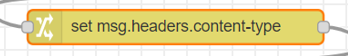

Dit voegt de juiste headers aan de file toe voor de browser.

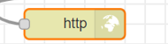

Geeft tot slot de informatie van de server terug aan de browser die ze origineel heeft opgevraagd.

Klik nu op deploy en test uit door naar [http://localhost:1880/index.html](http://localhost:1880/index.html) te surfen.

#### bevestigingsmail versturen

In dit stukje code zorgen we ervoor dat als de confirm.html pagina opgeroepen wordt eveneens een email verstuurd wordt.

Vooraleer we hieraan beginnen moeten we een aantal zaken nog doen:

1. De module email installeren

    * Klik terug op de 3 streepjes rechtsboven en dan manage pallet
    * In het tabblad install zoek je nu naar node-red-node-email en klik dan op install.

2. Je googleaccount voorbereiden zodat node-red die kan gebruiken

    *	Je bent er vrij van te doen wat je wil, maar hiervoor heb ik een nieuw account aangemaakt zodat er geen interactie is met mijn persoonlijk googleaccount.
    *	Log in en ga naar googleaccount beheren en kies vervolgens voor beveiligen.
    *	Kies voor dubbele authenticatie. Zorg dat je jouw gsm bij de hand hebt!
    *	Kies voor App-wachtwoorden, als app kies je email en als apparaat windows computer.
    *	Klik vervolgens op genereren en kopieer de toegangscode zodat je die straks kan gebruiken.

Laten we het stukje flow hiervoor even bekijken:

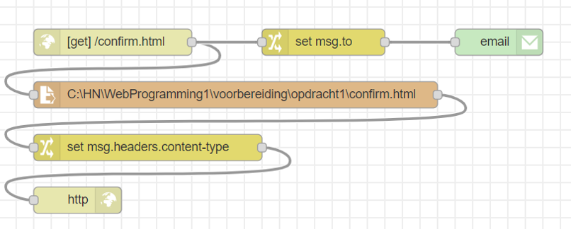

Die is gelijkaardig aan de vorige dia, vergeet niet om terug het path naar confirm.html aan te passen. Bij een submit zal de url aangevuld worden met `?` gevolgd door de informatie. Via de functie change kunnen we hieruit het emailadres halen.

Vervolgens moeten we nog de email node instellen. Plaats hierin je google-emailadres en de toegangscode die je hiervoor hebt aangemaakt.

Klik terug deploy en test. Je zou nu een email moeten ontvangen.

#### De data van het form bewaren

Aan de server kant willen we uiteraard de ingevulde informatie bewaren. Normaal doen we dit uiteraard in een database, in deze oefening bewaren we dit tijdelijk lokaal. Als we de server afsluiten zijn we uiteraard al onze informatie op dat ogenblik terug kwijt.


Via de functie-node kunnen we een stukje javascript gaan toevoegen. Hiermee zal de date van de confirm in een array bewaard worden.


In het stukje javascript maken we gebruik van de flow variabele, dit is de data die via de lijntjes van de code van node naar node wordt doorgegeven.

Om te vermijden dat bij de opstart, als er nog geen data is, er geen undefined in de array zou komen passen we de truc `||[]` toe. Hierdoor zal de eerste maal een lege array worden toegekend, vanaf dat er data is zal deze code niet meer uitgevoerd worden ( zie leerstof rond condities, wordt bekeken tot het punt dat de beslissing zeker is, rest van de code wordt dan niet meer doorlopen ) 

Als je de javascript hebt toegevoegd kan je dit terug gaan uittesten.

::: tip TIP

* Je kan altijd een debug-node verbinden aan een output van een functie om te onderzoeken wat er precies wordt doorgegeven.

* Als je debugt kan je tijdelijk ook de emails tegenhouden door te dubbelklikken op de node en die onderaan te disabelen (niet vergeten terug aan te zetten dan)
:::

#### De data beschikbaar stellen in een JSON formaat

Met dit laatste stukje code zorgen we ervoor dat de date in een JSON-formaat wordt geplaatst.


Probeer zelf deze nieuwe flow aan te maken.

Voor de functie heb je volgend stukje javascript nodig:

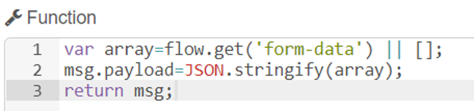

Voor de header is het **application/json** dat moet doorgegeven worden. (deze info kom je opzoeken op Mozilla)

Test uit door te surfen naar [http://localhost:1880/formdata.json](http://localhost:1880/formdata.json)


::: tip Taak 4 - Formvalidation 


* [opdrachtfiche](assignment4.html)
:::

## AJAX met tabellen en grafieken

### Asynchronous Javascript And XML (AJAX)

AJAX is een techniek om je webpagina te updaten zonder dat de volledige pagina opnieuw moet worden geladen.
Het is Google die deze techniek heeft geïntroduceerd in hun zoekmachine (als je in google iets begint te type worden suggesties gegeven).


Aanvankelijk werd hiervoor HTMLXMLRequest gebruikt, het grote nadeel was dat je voor elke browser een andere code nodig had.
Enige tijd late werd **JQuery** ontwikkeld waarmee je uniforme code kon schrijven en JQuery ging in de achtergrond dan het probleem van de verschillende browsers aanpakken.

Het is goed dat je JQuery kent maar voor nieuwe ontwikkelingen gebruik je het beter niet meer. Er wordt niet meer verder aan ontwikkeld. In de plaats hiervan gebruikt men nu de **‘fetch’ interface** die ingebouwd zit in de browsers.

Je kan [hier](https://www.w3schools.com/jquery/jquery_intro.asp) meer info over JQuery terugvinden.

Onthou vooral dat als je **een $-teken** in Javascript ziet staan dan heb je te maken met JQuery.

::: tip
Jquery moet eerst geladen zijn voor je de javascript laadt andersom zal de javascript die $ verwijzing niet begrijpen.
:::

Het probleem van code in een browser is dat deze rechtlijnig werkt en nergens kan halthouden. Moest je via Javascript code proberen te laten wachten op iets dan zou de browser denken dat de pagina blijft “hangen” en deze dus onderbreken.

Om dus te kunnen wachten op iets moet je het anders aanpakken:

* Via Callback (is een oude technologie)
*	Via Promise (is iets nieuwer)
*	Via Async en Await (is de nieuwste ontwikkeling)

#### Een callback voorbeeld via JQuery

```js
$(document).ready(function(){
    var data;
    document.getElementById('get').addEventListener('click',getData);
    function getData() {
        $.get("https://httpbin.org/get?a=1",processData);
    }
    function processData(response)
    {
        document.getElementById('result').textContent=JSON.stringify(response.args);
    }
  });
```

**$.get(url, callback functie)**: De url zal dus bevraagd worden, pas als er antwoord komt zal de callback functie worden uitgevoerd.

**Httpbin.org** is dummy server waar je de respons kunt meegeven en terugkrijgt, is om te testen

Het grootste probleem hierbij is als je een callback functie in een andere callback functie gebruikt is error afhandeling bijzonder moeilijk.

#### Een promise voorbeeld via fetch API

```js
document.getElementById('get').addEventListener('click', getData);
function getData() {
    fetch("https://httpbin.org/get?a=1").then(response => response.json()).
    then(response => { document.getElementById('result').textContent=
		JSON.stringify(response.args);  });
};
```
De fetch API is ingebouwd in de browser en werkt via promises. Op het einde van een ketting van .then() is er een .catch() om de errorafhandeling te doen.

De response komt al vanaf de eerste data die de server teruggestuurd, daarom moeten we response.json() gebruiken om alle response te verzamelen.

#### Een async/await voorbeeld

```js
document.getElementById('get').addEventListener('click', getData);
 async function getData() {
    let response = await fetch("https://httpbin.org/get?a=1");
    let json = await response.json();
    document.getElementById('result').textContent=
            JSON.stringify(json.args);
};
```

Je merkt dat via deze techniek de code veel leesbaarder lijkt en eerder trekt op gewone code zoals bij c# (code regel per code regel)

De functie zal bij elke Await de code verlaten en later op dat punt dan verder doen als de info beschikbaar is.

**Let op**: Deze techniek werkt niet bij oude browsers!

#### Herhaling via zelfstudie

Om de nieuwe leerstof nog beter te begrijpen kan je onderstaande bronnen even bekijken:

* Hoofdstuk 1 en 3 van het handboek [ebook](https://limo.libis.be/primo-explore/fulldisplay?docid=TN_springer_s978-1-4842-4395-4_313453&context=PC&vid=VIVES_KATHO&search_scope=ALL_CONTENT&tab=all_content_tab&lang=nl_BE:)

* Hoofdstuk 7 van [deze](https://www.linkedin.com/learning/learning-the-javascript-language-2) LinkedIn Learning videotutorial.

### JSON-data in een tabel weergeven via AJAX

We maken nu een pagina **formdata.html** aan die data uit formdata.json, die we in de vorige oefening via Node-red beschikbaar hebben gemaakt, leest en in een tabel weergeeft.

We maken eerst een de **formdata.html** pagina aan:

```html
<!DOCTYPE html>
<html>
    <head>
        <meta charset="utf-8">
        <title>callback jquery get</title>
    </head>
    <body>
        <div id="result"></div>
        <button id="get">GET</button>
        <script src="script.js"></script>
    </body>
</html>
```

Vervolgens schrijven we het **script.js** bestand.

We starten met het ophalen van de JSON data en we tonen dit als tekst:

```js
document.getElementById('get').addEventListener('click', getData);

async function getData() {
    let response = await fetch("http://localhost:1880/formdata.json");
    let json = await response.json();
    document.getElementById('result').textContent=JSON.stringify(json);
};
```
Test dit even uit:
* start node-red
* surf naar http://localhost:1880/index.html
* vul enkele keren het formulier in zodat er data in onze array komt te staan.
* Open nu in Visual Studio Code dit voorbeeld project en open **formdata.html** via de live server.
* Druk op 'get' , je zou jou input moeten zien.


> Wanneer je geen data krijgt wanneer je op GET drukt kan dit komen door CORS (**C**ross-**O**rigin **R**esource **S**haring). De browser verhindert dat er op "localhost:5500" data komt van een ander domein, "localhost:1180".
> * Mechanisme die via additionele HTTP headers een browser meldt dat een web applicatie die gestart werd op het origin domein permissie heeft om resources te gebruiken van een server in een ander domein
> * de server in het andere domein meldt via HTTP CORS headers dat resources mogen gebruikt worden door web applicaties in andere domeinen
> 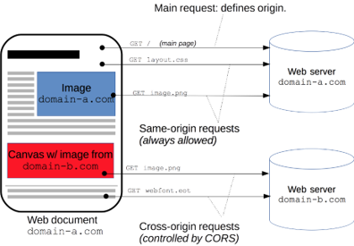
> Om domein B, in ons geval Node-RED cors headers mee te laten sturen dienen we het volgende aan te passen in het bestand: **c:\users\.node-red\settings.js**
> 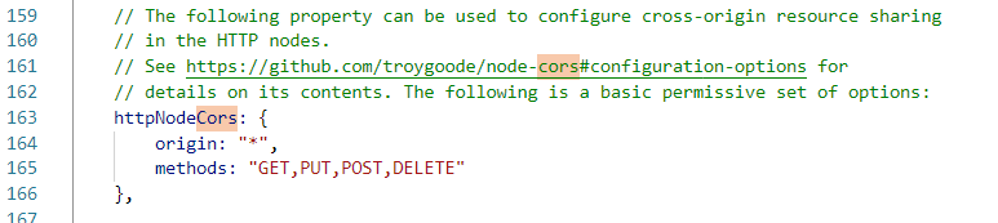
> Meer info hierover kan je op [Mozilla Developer](https://developer.mozilla.org/en-US/docs/Web/HTTP/CORS) terugvinden.

Om nu de data in een tabel te tonen kunnen we gebruik maken van de eerder gemaakte oefening 'Een tabel aanvullen met javascript'.

1. Maak een functie addRow:

```js
function addRow(email) {
    let tBody=document.getElementById("formdataTable");
    let row=tBody.insertRow(-1);

    let cell=row.insertCell(-1);
    let emailTextNode=document.createTextNode(email);
    cell.appendChild(emailTextNode);
}
```

2. Doe een fetch, doorloop de verkregen array met een foreach:

```js
async function getData() {
    let response = await fetch("http://localhost:1880/formdata.json");
    let json = await response.json();
    json.forEach (obj => addRow(obj.email));
}    
```

Test even uit.

### JSON-data in een Google chart weergeven via AJAX

Google chart is een bibliotheek die grafieken tekent met HTML en SVG.

Je kan een Quickstart [hier](https://developers.google.com/chart/interactive/docs/quick_start) terugvinden.

#### Laten we even een voorbeeld bekijken met Google Chart


In je HTML moet je de bibliotheek laden:

```html
<!DOCTYPE html>
<html lang="en">
<head>
    <meta charset="UTF-8">
    <meta name="viewport" content="width=device-width, initial-scale=1.0">
    <title>Google chart</title>    
</head>
<body>
    <!-- Plaats voor grafiek -->
    <div id="chart_div"></div>
    <!-- De bibliotheek laden -->
    <script type="text/javascript" src="https://www.gstatic.com/charts/loader.js"></script>
    <!-- Onze eigen script file -->
    <script src="script.js"></script>
</body>
</html>
```
::: warning Let op
  Dit moet voor je eigen script geladen worden.
  :::

Vervolgens maken we het script:

```js
// De load functie starten met als argument de nodige packages (afhankelijk van welk type grafieken je wilt gebruiken
google.charts.load('current', {'packages':['corechart']});

// Daarna een functie (hier drawchart) registreren die aangeroepen wordt als het laden compleet is
google.charts.setOnLoadCallback(drawChart);

// De functie drawChart aanmaken
function drawChart() {

  // Een DataTable aanmaken
  let data = new google.visualization.DataTable();
      data.addColumn('string', 'Topping');
      data.addColumn('number', 'Slices');
      data.addRows([
        ['Mushrooms', 3],
        ['Onions', 1],
        ['Olives', 1],
        ['Zucchini', 1],
        ['Pepperoni', 2]
      ]);
  
  // De grafiek opties definiëren
  let options = {'title':'How Much Pizza I Ate Last Night',
                  'width':400,
                  'height':300};

  // De grafiek definiëren
  let chart = new google.visualization.PieChart(document.getElementById('chart_div'));

  // De grafiek tekenen
  chart.draw(data, options);
}
```

#### Een voorbeeld met een lijngrafiek

Je kan [hier](https://developers.google.com/chart/interactive/docs/gallery/linechart) meer info nalezen over het maken van lijngrafieken. 


We gebruiken dezelfde html als in het vorige voorbeeld.

Het script ziet er als volgt uit:

```js
// We laden terug de functie met de line package
google.charts.load('current', { 'packages': ['line'] });
google.charts.setOnLoadCallback(drawChart);

function drawChart() {

    // We maken terug zelf onze data aan
    let data = new google.visualization.DataTable();
    data.addColumn('string', 'Date');
    data.addColumn('number', 'value');


    data.addRows([
        ["2020-01-01", 10],
        ["2020-01-02", 1],
        ["2020-01-03", 3],
        ["2020-01-04", 2],
        ["2020-01-05", 2],
        ["2020-01-06", 1]
    ]);
    
    // Stellen de grafiekopties in
    let options = {
        chart: {
            title: 'date versus value',
            subtitle: 'none'
        },
        width: 900,
        height: 500
    };

    // Definiëren de grafiek
    let chart = new google.charts.Line(document.getElementById('chart_div'));

    // En tot slot tekenen we de grafiek
    chart.draw(data, google.charts.Line.convertOptions(options));
}
```

#### Een voorbeeld van een lijngrafiek uit JSON data

We gebruiken terug dezelfde html pagina

We maken een data.json bestand aan met volgende inhoud:

```json
{
    "2020-03-23": 10,
    "2020-03-24": 5,
    "2020-03-25": 7,
    "2020-03-26": 8,
    "2020-03-27": 8,
    "2020-03-28": 8,
    "2020-03-29": 12
}
```
Ons script ziet er dan als volgt uit:

```js
google.charts.load('current', { 'packages': ['line'] });
google.charts.setOnLoadCallback(drawChart);

// async definitie voor fetch data
async function drawChart() {

    let data = new google.visualization.DataTable();
    data.addColumn('string', 'Date');
    data.addColumn('number', 'value');

    // await definitie voor fetch data
    let response = await fetch("data.json");
    let json = await response.json();
    // ontvangen data toevoegen aan dataTable
    Object.keys(json).forEach (date => data.addRows([[date,json[date]]]));     

    let options = {
        chart: {
            title: 'date versus value',
            subtitle: 'none'
        },
        width: 900,
        height: 500
    };

    let chart = new google.charts.Line(document.getElementById('chart_div'));

    chart.draw(data, google.charts.Line.convertOptions(options));
}
```

### Chart.js als alternatief op Google Chart

De bibliotheek **chart.js** is gelijkaardig aan google chart, je kan [hier](https://www.chartjs.org/) meer informatie terugvinden.

#### Html

Om de biblotheek te gebruiken moet je de **C**ontent **D**elivery **N**etwork toevoegen aan je HTML

```html
<script type="text/javascript" src="https://cdn.jsdelivr.net/npm/chart.js"></script>
```

In jou html pagina moet je dan een canvas element voorzien waar de grafiek moet komen.

```html
<canvas id="myChart" width="400" height="400"></canvas>
```

#### Javascript

In jou script moet je eerst een variabele maken die verwijst naar het 2D gedeelte van jou canvas.

```js
let ctx = document.getElementById('myChart').getContext('2d');
```

De data moet in array's komen.

```js
var labels=["2020-10-1","2020-10-2","2020-10-3"]; // labels voor de x-as
var data=[6000,6500,6300];  // data gegevens
```

Meestal zit de data in een JSON object, je kan key's en value's als volgt tot array's vormen:

```js
let labels = Object.keys(json) // een array met alle key's
let data = Object.values(json) // een array met alle value's
```

Vervolgens kan je de grafiek tekenen.

```js
var myLineChart = new Chart(ctx, {
    type: 'line',
    data: {        
        labels: labels,
        datasets: [{
            data: data,
            lineTension: 0, 
        }],
    },
    //options: hier kan je nog opties voor de grafiek plaatsen.
});
```

Je kan meer info terugvinden op [chartjs.org](https://www.chartjs.org/docs/latest/getting-started/).

::: tip Taak 5 - JSON data visualiseren in een tabel en grafiek


* [opdrachtfiche](assignment5.html)
:::

## Web API

Een Application Programming Interface is een software service dat een set aan functies online beschikbaar stelt voor anderen.

Zoals bv:
* lezen en opzoeken van data
* weer service
* het updaten van content
* autentificatie
* complexe berekeningen
* comprimeren of converteren van afbeeldingen

Het vinden van een API kan lastig zijn. Alle grote web applicaties zoals Youtube, Google Maps, Dropbox, Twitter, ... hebben er een, maar er zijn ook ontelbare kleine specifieke API's die je ofwel doorkrijgt van een fabrikant of eventueel kan opzoeken via [rapidapi.com](https://rapidapi.com/marketplace).

**Let op:** Niet alle API's zijn zomaar gratis!

### Philips Hue API

Laten we even een IoT toepassing bekijken.

We gaan aan de slag met Philps Hue:
* domotical oplossing van Signify (Philips lighting)
* bridge (vierkant bakje, met drukknop in het midden) maakt connectie tussen ethernet en zigbee
* lampen, schakelaars, ... communiceren via zigbee (werkt tot 100 meter ver, elk device is ook een range extender)

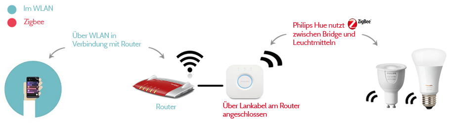

Op de campus Kortrijk is een bridge verbonden met een Telenet router. Via port forwarding is de bridge van thuis bereikbaar.

De bridge  luistert op poort 80, de Telenet router is als volgt ingesteld: binnenkomende verbindingen op poort 49152 gaan naar poort 80

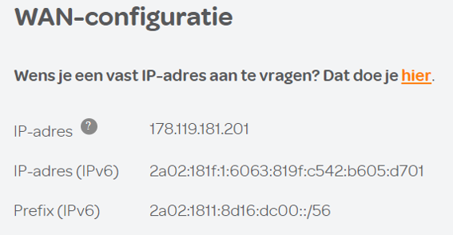

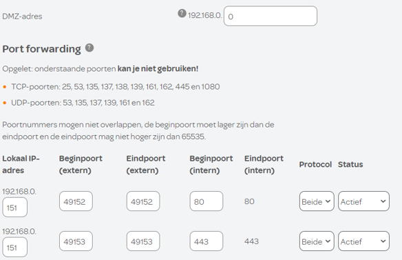

Je kan [hier](https://developers.meethue.com/develop/get-started-2/) alvast wat uitleg over de Web API van Philips Hue nalezen.

#### De status van de Philips HUE opvragen

* GET request naar volgende URL http://178.119.181.201:49152/api/d8cHvqBsSW9iVf6lLMlisoJj96RfV7VybBRwmD42/lights (via je browser).

* Om het JSON formaat netjes op je browser te krijgen kan je de [json formatter chrome extensie](https://chrome.google.com/webstore/detail/json-formatter/bcjindcccaagfpapjjmafapmmgkkhgoa) installeren.

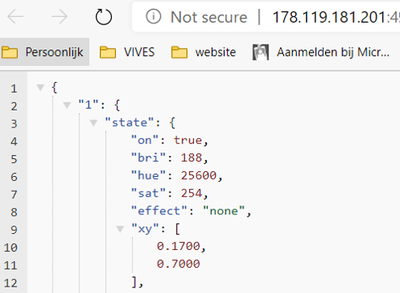

#### Een lamp aan- of uitzetten.

* PUT request naar volgende URL http://178.119.181.201:49152/api/d8cHvqBsSW9iVf6lLMlisoJj96RfV7VybBRwmD42/lights/1/state

* body met JSON: {"on":false} merk op dat false een boolean is, geen string en dus zonder aanhalingstekens


Vanuit de console van je browser kan je dit testen met:

```js
fetch("http://178.119.181.201:49152/api/d8cHvqBsSW9iVf6lLMlisoJj96RfV7VybBRwmD42/lights/1/state",
{
method: "PUT",
body: JSON.stringify({"on":true})
})
.then(function(res){ console.log(res) })
.catch(function(res){ console.log(res) })
```

Je zou volgende resultaat moeten zien:

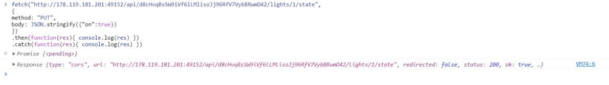

#### Aansturen via een webpagina

Je kan nu een webpagina maken met een image waar er ofwel [lamp_on.jpg](/files/lamp_on.jpg) of [lamp_off.jpg](/files/lamp_off.jpg) in komt:

```html
<!DOCTYPE html>
<html>
    <head>
        <meta charset="UTF-8">
        <title>Fetch lamp</title>
        <script src="script.js"></script>
    </head>
    <body>
        
    </body>
</html>
```
Vervolgens heb je een script nodig die enerzijds de lamp aanstuurd maar ook de afbeelding wisseld.

```js
window.addEventListener(('load'), (event) => {
    console.log(document.getElementById("lamp").src);

    document.getElementById("lamp").onclick = async () => {
        let lamp_on=false;
        if (document.getElementById("lamp").src.indexOf("lamp_on.jpg") != -1) {
            document.getElementById("lamp").src = "lamp_off.jpg";
            lamp_on=false;
        }
        else {
            document.getElementById("lamp").src = "lamp_on.jpg";
            lamp_on=true;
        }

        let response = await fetch("http://178.119.181.201:49152/api/d8cHvqBsSW9iVf6lLMlisoJj96RfV7VybBRwmD42/lights/1/state",
        {
            method: "PUT",
            body: JSON.stringify({"on":lamp_on})
        })
        let json= await response.json();
        console.log(json);

        };
});
```
**Merk op**: Via indexOf wordt nagegaan op welke positie "lamp_on.jpg" in de src string voorkomt, dit omdat de string de volledige url bevat, -1 wil zeggen dat deze niet voorkomt

### Rest API

Om data naar een server te sturen en op te halen wordt veelal gebruik gemaakt van een **rest api**.

Bekijk [hier](https://www.restapitutorial.com/lessons/whatisrest.html) even het filmpje en de informatie over de 6 eigenschappen van REST API.

#### HTTP methodes

Meer informatie over de gebruikte methodes kan je [hier](https://www.restapitutorial.com/lessons/httpmethods.html) nalezen.

**GET**

Wordt gebruikt door de browser om een url op te halen. Het is mogelijk om data mee te sturen naar de server doordat in de url te plaatsen:

https://httpbin.org/get?a=1&b=test


Na het vraagteken komen de parameters:
* parameter "a" met als waarde 1
* parameter "b" met als waarde test
* tussen de verschillende parameters staat er telkens een &

**POST**

Wordt gebruikt om iets te creëren op de server.
Bij de browser is het zo dat een form veelal gesubmit wordt met een POST, de submit veroorzaakt immers de creatie van iets op de server (bijvoorbeeld data aan database toevoegen)
De parameters worden meegstuurd in de body van de HTTP POST en zijn niet zichtbaar in de URL

**PUT en PATH**

Wordt gebruikt om data te wijzigen op de server.

**DELETE**

Wordt gebruikt om data te wissen op de server.

#### Uittesten van een rest api

Je kan hiervoor [postman](https://www.postman.com/) gebruiken.

Installeer de app, voeg een http get request toe naar `https://httpbin.org/get?a=1&b=test ` en test uit.

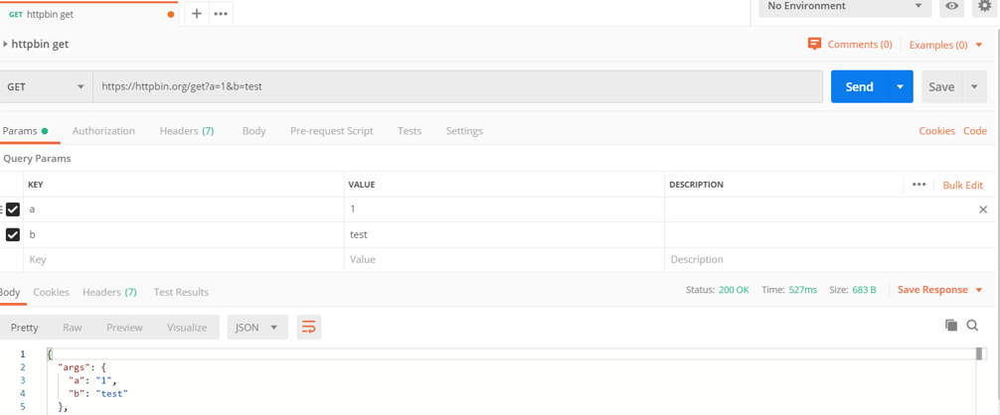

### Weather API

Openweathermap.org stelt een api ter beschikken waarmee je, afhankelijke van jou licentie, weersinformatie kan ophalen.

Laten we starten met een gratis API key aan te vragen door naar [licentie](https://openweathermap.org/price) te surfen en op **Get API key and start** te klikken.


Met deze gratis API key kunnen we het huidige weer voor een locatie opvragen. De API ziet er als volgt uit:

`https://api.openweathermap.org/data/2.5/weather?q={city name}&appid={your api key}&units={local units}&lang={your language}`

Test dit even uit:
* city name = brugge of kortrijk
* your api key = de key die je kreeg bij de aanvraag 
* local units = metric
* local language = nl

Kijk even welke info je allemaal binnenkrijgt.

Laten we even een oefening maken om het huidige weer te visualiseren.

Het html en css gedeelte laat ik aan jullie over, dus laten we onmiddelijk starten met het script.

We starten met enkele constanten te definieren:

```js
const country = "kortrijk"; // of brugge
const API_key = "your API key"; // vul hier je eigen API key in.
const units = "metric";
const language = "nl";
```

Vervolgens willen we dat het weer telkens up to date blijft op de pagina:

```js
window.setInterval(getWeather,1000); // elke seconde wordt de functie getWeather terug opgeroepen
```

Nu moeten we in de `getWeather()` functie een api fetch doen:

```js
async function getWeather(){

    let response = await fetch("https://api.openweathermap.org/data/2.5/weather?id="+country_id+"&units="+units+"&lang="+language+"&appid="+API_key);
    let json = await response.json();   
    console.log(json);


}
```
In de console kan je nu kijken welke info je krijgt en waar die staat.

We vullen nu onze functie aan met die informatie:

```js
document.getElementById('curtemp').textContent=Math.round(json.main.temp)+" °C";
    document.getElementById('curhumi').textContent=json.main.humidity+" %";
    document.getElementById('curwind').textContent=Math.round(3.6*json.wind.speed)+" km/h";
    document.getElementById('curwinddir').textContent=json.wind.deg+" °";
    document.getElementById('curtekst').textContent=json.weather[0].description;
```

In jou html moet je dus elementen voorzien die deze informatie kunnen ontvangen.

Om het icoon op te vragen moet je een klein ommewegetje maken. nl je hebt het url van het icoon nodig. Dit ziet er als volgt uit: `http://openweathermap.org/img/wn/10d@2x.png`  waar die `10d` de verwijziging is die je via de json data krijgt.

Je kan het icoon dus als volgt ophalen:

```js
document.getElementById('curicon').src="http://openweathermap.org/img/wn/"+json.weather[0].icon+"@2x.png";
```

::: tip Taak 6 - Weersvoorspelling


* [opdrachtfiche](assignment6.html)
:::

## Cheatsheet

[Hier](/files/cheatsheet_js.pdf) kan je een cheatsheet terugvinden ter ondersteuning van taken, toetsen, projecten en werkplekleren.
