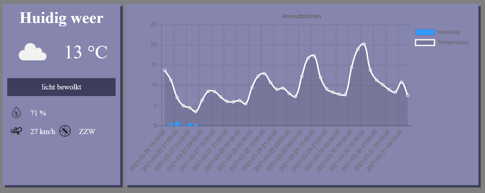

# Weersvoorspelling

## Opdracht
Ontwerp een webpagina  die:
* het verwachte weersbeeld voor vandaag weergeeft.
* voor de komende 5 dagen de verwachte temperatuur en neerslag per 3 uur in een chart.js grafiek voorstelt.

Je webpagina zou er bv zo kunnen uitzien:

    
## Tips

De API dat je hiervoor kan gebruiken is:

`https://api.openweathermap.org/data/2.5/forecast?q={city name}&appid={your api key}&units={local units}&lang={your language}`

Gebruik de zelfde methodiek, kijk eerst wat je binnen krijgt aan json object en vertrek van daar uit.

## Evaluatie

Deze opdracht staat op **15%** van de totaalscore voor het vak Web Development 2.

Er zal op het volgende geëvalueerd worden:
* Is je opbouw van de pagina volgens het ‘good-practice’ principe is.
* Is de basis HTML en CSS correct gebruikt.
* Is je javascript correct geschreven.
* Zijn de minimum gevraagde items aanwezig en correct geïmplementeerd.

