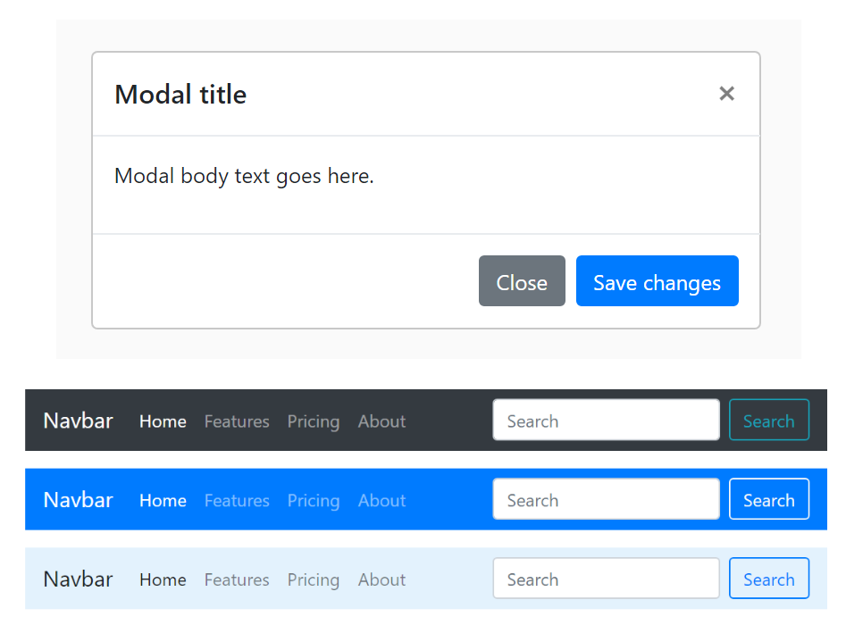

# Online styling van je webpagina

## Gebruik maken van Bootstrap

Bootstrap CSS is het toonaangevende CSS framework voor het ontwikkelen van responsive en mobile-first websites. Deze gratis en open-source toolkit wordt geleverd met een responsive grid systeem, globale CSS instellingen, uitgebreide vooraf gebouwde componenten waaronder knoppen, navigatiebalken en formulieren, en optionele JavaScript plugins om het ontwikkelproces te versnellen.

### Downloaden van Bootstrap

Hiervoor ga je naar [Bootstrap](https://getbootstrap.com/docs/4.6/getting-started/download/) en download je de Compiled versie van Bootstrap. Het Zip-bestand pak je uit in de root van je website en je hermoemt de folder gewoon 'Bootstrap'.

### Laden van Bootstrap

Om Bootstrap te laden ga je op gelijkaardige manier te werk als je eigen CSS bestand.

```html
<link rel="stylesheet" href="bootstrap/css/bootstrap.min.css">
```

Als je ook het Javascript gedeelte van Bootstrap wil gebruiken voeg je volgende toe in de footer van je html.

```html
<script src="https://code.jquery.com/jquery-3.3.1.slim.min.js"></script>
<script src="bootstrap/js/bootstrap.min.js"></script>
```

### Een greep uit de vele Bootstrap componenten 




### Gebruik maken van Bootstrap CSS opmaak

Het gebruik van een van deze Bootstrap componenten is heel eenvoudig. Het is gewoon een kwestie van verwijzen naar de juiste Bootstrap CSS klasse in de HTML markup. Bijvoorbeeld, hier is hoe we Bootstrap's primair gekleurde knop gebruiken op een webpagina...

```html
 <button type="button" class="btn btn-primary">Primary</button>
```
Waarom heeft de button 2 classes  `.btn` en `.btn-primary` ?

Bootstrap's componenten zijn gebouwd met een basis-modifier klasse aanpak. Dit betekent dat het grootste deel van de styling is ondergebracht in een basisklasse (bijv. .btn), terwijl stijlvariaties zijn beperkt tot modifier-klassen (bijv. .btn-primary).

Het principe van Bootstrap is dus vrij eenvoudig, het is alleen in het begin wat uitzoeken welke klasse je precies nodig hebt.

## Gebruik maken van FontAwesome

Het gebruik van pictogrammen in webdesign is een beproefde methode om een website te moderniseren en de gebruikersstroom te sturen. Het toevoegen van pictogrammen aan de inhoud van uw site helpt een gebruiker de informatie die u probeert over te brengen beter te verwerken en biedt een visueel focuspunt dat een gebruiker naar een specifieke sectie leidt.

Grafische pictogrammen kunnen op tal van manieren worden gebruikt om uw webdesignproject meer pit te geven. U kunt ze gebruiken als visuele begeleiding van tekstgebieden of als op zichzelf staande links in situaties waar de ruimte beperkt is en tekstblokken niet haalbaar zijn binnen het ontwerp. Het is deze veelzijdigheid van iconen die ze zo nuttig en wijdverspreid maakt.

Gelukkig is het niet nodig om uw eigen pictogrammenset te maken. Font Awesome biedt een veelzijdig kader dat bijna elke icoonafbeelding bevat die u zich kunt voorstellen, samen met de benodigde schaalbaarheid en aanpassingsmogelijkheden. Font Awesome zal u vrijwel zeker tijd en geld besparen bij uw toepassing van specifieke pictogrammen.

### Laden van FontAswesome

Om FontAwesome te laden ga je terug op dezelfde manier tewerk.

```html
<link rel="stylesheet" href="https://use.fontawesome.com/releases/v5.15.4/css/all.css" type="text/css"/>
```

### Een icoon toevoegen

Laten we als voorbeeld eens het RSS icon toevoegen.

```html
<i class="fa fa-rss"></i>
```

Als je nu de grootte van het icoon wil aanpassen voeg je dit gewoon toe.

```html
<i class="fa fa-rss fa-3x"></i>
```

Het is nu dus kwestie van het gewenste icoon op te zoeken op [FontAwesome](https://fontawesome.com/icons) en de daarbij horende class toe te passen.

## Oefening

::: tip Bootstrap en FontAwesome oefening

Maak de oefening op het elektronisch leerplatform en laad die op.

:::

## Take-home opdracht

::: tip Herhaling Bootstrap & FontAwesome

Om de nieuwe leerstof nog beter te begrijpen volg je onderstaande videotutorial:

* [Bootstrap](https://www.linkedin.com/learning/bootstrap-4-essential-training)

* [Font Awesome](https://www.youtube.com/watch?v=rXiO4bm2Zpc)

Na het volgen van deze online cursus vul je het vragenformulier in op Toledo.

:::
