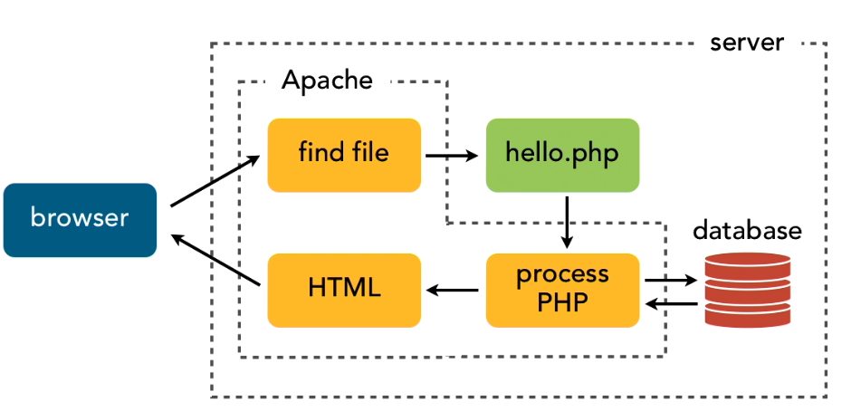
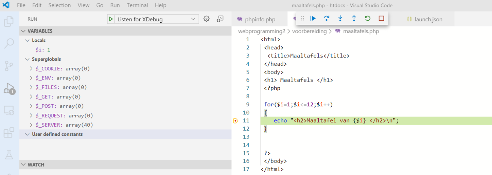
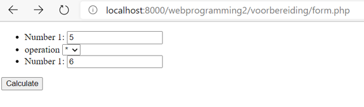
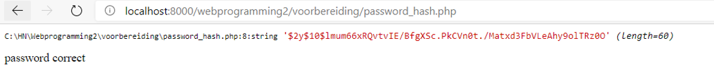

# Back-end webdevelopment met PHP

Bij Back-End wordt door de client een request gestuurd naar de webserver die op zijn beurt de nodige HTML, CSS en JS bestanden zal aanmaken en als antwoord terugsturen.



## Installatie software

Om de PHP taal lokaal te kunnen hosten hebben we Apache en PHP nodig en om data te gebruiken ook MySQL.
Om dit operating systeem onafhankelijk te maken is er gekozen om te werken met het installatiepakket XAMPP.

Ga naar [de website van XAMPP](https://www.apachefriends.org/download.html) en download de hoogste PHP versie voor jou operating systeem.
Installeer vervolgens met alle default waarden.

::: warning Installatie path
Zorg er voor dat je installatie path `c:\xampp` is.
:::

Configuratie's kan je doen via het XAMPP controle panel.

Wat als poort 80 reeds bezet is? Je kan jou Apache server ook via een andere poort laten werken.
Ga via het XAMPP control panel naar de `httpd.conf` file en maak onderstaande aanpassingen:

```conf
Servername localhost:80 // wijzig de 80 naar bv 8000
...
listen 80 // wijzig ook hier de 80 naar dezeflde poort als je hierboven hebt gekozen
```
Om te controleren dat je Apache server en PHP goed werken kan je het volgende testbestand `phpinfo.php` aanmaken in de folder `C:\xampp\htdocs`:

```php
<?php
    phpinfo();
?>
```
Tik vervolgens in je browser `localhost[:jouw poort]/phpinfo.php`(het : met jouw poort is enkel nodig als je niet met poort 80 werkt).
Als alles goed is krijg je nu een overzicht van PHP. 

<!-- TODO: uittesten en debugging extensie toevoegen -->

Om een mail te kunnen versturen vanuit onze localhost moeten we enkele instellingen juist zetten.

1. Een google account voorbereiden

* Je maakt hiervoor best een nieuw GMail-account aan die voor ontwikkelingsdoeleinden kan gebruiken.
* Log via een incognitovenster in op het nieuwe GMail-account.
* Kies in je accountbeheer voor dubbele authenticatie (Zorg er voor dat je jouw gsm bij de hand hebt).
* Kies voor App-wachtwoorden, als app kies je email en als apparaat windows computer.
* Klik vervolgens op genereren en kopieer de toegangscode zodat je die straks kan gebruiken.

2. Open het bestand `php.ini` via het XAMPP control panel en pas volgende regels aan:

```ini
[mail function] 
SMTP=smtp.gmail.com
smtp_port=587
sendmail_from = YourGmailId@gmail.com
sendmail_path = "\"C:\xampp\sendmail\sendmail.exe\" -t"
```

3. Ga naar de folder `C:\xampp\sendmail`, open er het bestand `sendmail.ini` en pas volgende regels aan (gewoon de ~ verwijderen):

```ini
[sendmail]
smtp_server=smtp.gmail.com
smtp_port=587
error_logfile=error.log
debug_logfile=debug.log
auth_username=YourGmailId@gmail.com
auth_password=Your-Gmail-app-pasword
force_sender=YourGmailId@gmail.com
```
::: warning Restart Apache server
Je zal de apache server moeten herstarten, je kan dit via XAMPP control panel doen.
:::

## Week 1 - Introductie in PHP

 

PHP is een **Server-side** scripttaal gebruikt om een webpagina dynamisch te maken. Voor de gebruiker is de PHP scripttaal onzichtbaar, enkel het resultaat er van.

Voor we van start gaan, nog even meegeven dat je ook veel informatie op de [php.net](https://www.php.net/manual/en/) website kan terugvinden.

[Hier](/files/cheatsheet_php.pdf) kan je een cheatsheet terugvinden ter ondersteuning van taken, toetsen, projecten en werkplekleren.

### Inleiding

Net zoals bij Javascript start PHP met een opening tag en eindigt het met een closing tag. Ook wordt net zoals bv bij C# elke coderegel beëindigd met een `;`.

```php
<?php
    //Hier komt de PHP code
?>
```
Als we PHP code schrijven dan doen we dat in een bestand met de extensie `.PHP`. Je zou de code ook bv in je HTML kunnen schrijven, maar dan wordt deze niet uitgevoerd.

Om PHP iets te laten weergeven naar de gebruiker gebruiken we het commando `echo`.

```php
<?php
    // Dit zal de tekst Hello world tonen
    echo "Hello world";
    // Dit zal de teksten Hello en world samenvoegen en tonen
    echo "Hello" . " world";
    // Dit zal de som van 2 + 3, dus 5 tonen
    echo 2 + 3;
?>
```
Zoals je in de code hierboven reeds kon vaststellen is het bij PHP eveneens mogelijk om commentaar toe te voegen aan je code. Dit is een 'best-practice' techniek die sterk aangeraden wordt. Het kost je wat extra tijd bij het schrijven van je code, maar nadien haal je er veel winst bij als jij of iemand anders je code moet lezen of aanpassen.

```php
<?php
    // op deze manier kan je een enkele lijn commentaar toevoegen
    /* op deze manier kan je meerdere lijnen commentaar
       toevoegen, of een stukje code tijdelijk uitschakelen */ 
?>
```
### Datatypes

Net zoals in andere programeercode kunnen we variabelen definiëren van verschillende datatypes.

::: tip Tip
Variabele namen zijn hoofdletter gevoelig in PHP, m.a.w. $color, $Color en $COLOR zijn drie verschillende variabelen!
:::

#### Strings

Net zoals bij Javascript kan je je string met `"` of `'` definiëren. Maak er een gewoonte van om dit steeds met `"` te doen.

Het volgende voorbeeld neemt twee string variabelen voegt deze samen in een derde en toont deze vervolgens aan de gebruiker.

```php
<?php
    $groet = "Beste";
    $doel = "studenten";
    $zin = $groet . " " . $doel;
    echo $zin;
?>
```
Je kan ook de variabele in je tekst plaatsen, maar dit werkt enkel als je de tekst met `"`definieert.

```php
<?php
    echo "$zin , welkom in de cursus PHP."
    // het resultaat is: Beste studenten, welkom in de cursus PHP.
    echo '$zin , welkom in de cursus PHP.'
    // het resultaat is: $zin , welkom in de cursus PHP.
    // waarschijnlijk niet het resultaat wat je wou.

    // Als je de komma direct na de inhoud van zin wil moet je duidelijk maken wat de variable is via {}
    echo "{$zin}, welkom in de cursus PHP."
    // Beschouw dit terug als de best-practice.
?>
```
Laten we nu even wat frequent gebruikte bewerkingen met strings bekijken.

```php
<?php
    // definiëren van strings
    $tekst1 = "The quick brown fox";
    $tekst2 = " jumped over the lazy dog.";

    // toevoegen van een string aan een variabele
    $tekst3 = $tekst1;
    $tekst3 .= $tekst2; // $tekst2 toevoegen aan $tekst3

    // tekst in 'lowercase' weergeven
    echo strtolower($tekst3);
    
    // tekst in 'uppercase' weergeven
    echo strtoupper($tekst3);

    // de eerste letter het eerste woord van de string in 'uppercase' weergeven
    echo ucfirst($tekst3);

    // alle eerste letters van de woorden in de string in 'uppercase'weergeven
    echo ucwords($tekst3);

    // de lengte van een string weergeven
    echo strlen($tekst3);

    // alle spaties vooraan en achteraan een string verwijderen
    echo "A" . trim(" B C D ") . "E";
    // het resultaat is dan AB C DE

    // zoek het woord 'brown' en geef vanaf daar de string weer
    echo strstr($tekst3,"brown");

    // vervang het woord 'quick' in de string door 'super-fast'
    echo str_replace("quick", "super-fast", $tekst3);

    // herhaal een aantal keer de string
    echo str_repeat($tekst3, 2);

    // geef het stukje string weer vanaf letter 5 en 10 letters lang
    echo substr($tekst3, 5, 10);

    // geeft de positie van het woord 'brown' weer in de string
    echo strpos($tekst3, "brown");

    // zoek de letter 'z' en geef vanaf daar de string weer
    echo strchr($tekst3, "z");
?>
```

#### Integer

Bij het werken met getallen zijn ook hier de wiskundige regels geldig.

Laten we even frequent gebruikte bewerkingen en functies met integers bekijken:

```php
<?php
    // definiëren van integers
    $getal1 = 3;
    $getal2 = 4;

    // Een gewone berekening
    echo ((1 + 2 + $getal1) * $getal2) / 2 - 5;
    // daarnaast bestaan ook de ++ , -- , += , -= , *= en /= mogelijkheden

    // Geeft de absulute waarde weer
    echo abs(0 - 300);

    // Geeft 2 tot de 8ste macht weer 
    echo pow(2, 8);

    // Geeft de vierkantswortel van 100 weer
    echo sqrt(100);

    // Geeft de rest van de deling 20/7 weer
    echo fmod(20, 7);

    // Geeft een willekeurig getal weer
    echo rand();

    // Geeft een willekeurig getal tussen 1 en 10 weer
    echo rand(1, 10);

    // Geeft weer als een variabele een integer is
    echo is_int($getal2);
?>
```

#### Floating point

De definitie en bewerkingen van integers zijn hier eveneens van toepassing, er zijn enkele specifieke functies mogelijk:

```php
<?php
    $getal1 = 3.14;
    $getal2 = $getal1 + 10;
    $getal3 = 4/3;

    // Geeft het komma getal weer afgerond tot 1 cijfer na de komma
    echo round($getal1);

    // Geeft het komma getal weer als een integer afgerond naar boven
    echo ciel($getal2);

    // Geeft het komma getal weer als een integer afgerond naar beneden
    echo floor($getal3);

    // Geeft weer als een variabele een float is
    echo is_float($getal3);

    // Geeft weer als een variabele numeriek is
    echo is_numeric($getal2);
    // Dit zal dus zowel bij een integer als een float waar als resultaat hebben.
?>
```

#### Array

Net zoals in andere code talen kunnen we hier ook gebruik maken van een array die om het even welk dataytype kan bevatten.

```php
<?php
    // definiëren van een lege array
    $numbers = array();

    // definiëren van een array met voor gedefinieerde objecten
    $numbers = array(4,8,15,16,23,42);

    // geeft het object weer op de index positie startende vanaf 0 
    echo $numbers[1]; // 8

    // definiëren van een array met verschillende datatypes
    $mixed = array(6, "fox", "dog", array("x", "y", "z"));

    // geeft een object in een geneste array terug
    $mixed[3][1]; // y

    // een waarde toewijzen aan een index
    $mixed[2] = "cat";

    // als we dit doen voor een niet bestaande index zal die aangemaakt worden
    $mixed[4] = "mouse";

    // als je niet weet hoeveel indexen er zijn kan je op die manier iets aan het einde toevoegen
    $mixed[] = "horse";

    // vanaf PHP versie 5.4 en later is er een verkorte notitiewijze
    $numbers = [1,2,3];
?>
```

Stel dat je niet exact weet wat er in een array zit en je wil dat om te debuggen even tonen dan kan je dit op volgende manier doen:

```php
<?php
    $mixed = array(6, "fox", "dog", array("x", "y", "z"));
    // debugging
    echo "<pre>" . print_r($mixed) . "</pre>";
?>
```


Een array is dus een geordende structuur op basis van een index nummer. In PHP hebben we echter ook een niet geordende array (associative array) op basis van labels. In vak termen spreekt men van de **Key** en de **Value**.

```php
<?php
    // definiëren van een associative array
    $assoc = array("Voornaam" => "Jan", "Naam" => "Janssen");

    // geeft de value terug voor de key = Voornaam
    echo $assoc["Voornaam"];

    // een value voor een key aanpassen doe je zo
    $assoc["Voornaam"] = "Piet";
?>
```

Laten we nu even enkele frequent gebruikte functies bij arrays bekijken.

```php
<?php
    // we definiëren een array met nummers in willekeurige volgorde
    $numbers = array(8,23,15,42,16,4);

    // Geeft het aantal indexen in een array weer
    echo count($numbers); // 6

    // Geeft het grootste getal weer in een array
    echo max($numbers); // 42

    // Geeft het kleinste getal weer in een array
    echo min($numbers); // 4

    // Sorteert de array van klein naar groot
    sort($numbers);

    // Sorteert de array van groot naar klein
    rsort($numbers);

    // Maakt een door komma gescheiden string van de array
    $num_string = implode(" , ", $numbers);

    // Maakt een array van een door komma gescheiden string
    $input = explode(" , ", $num_string);

    // Geeft weer als een iets voorkomt in een array
    echo in_array(15, $numbers);    // True

    // Geeft de key's uit een array
    array_keys($input);
    // Geeft de value's uit een array
    array_values($input);
?>
```

Je kan nog meer functies terugvinden op [php.net](https://www.php.net/manual/en/ref.array.php)

#### Booleans

In PHP kan je eveneens een **true** of **false** resultaat bewaren in een variabele.

```php
<?php
    // Definiëren van een boolean
    $result1 = true;
    $result2 = false;

    // Controleren of een variabele van het datatype boolean is
    is_bool($result1);
?>
```

#### Ongedefinieerd of NULL

Je kan in PHP perfect een variabele aanmaken die nog geen value heeft.

```php
<?php
    // Definiëren van een variabele zonder waarde of datatype
    $var1 = null;

    // Controlleren of een variabele ongedefinieerd is
    is_nul($var1);

    // Controlleren of een variabele gedefinieerd is
    is_set($var1);

?>
```

#### Conversie naar een ander dataype

Net zoals in C# is het in PHP 'good-practice' om conversie naar een andere datatype zelf te voorzien i.p.v. op PHP te vertrouwen om het voor jou te doen.

```php
<?php
    // We definiëren een nummer
    $var = 3;

    // We converteren dit naar een string
    (string) $var
?>
``` 

#### Constanten

In PHP is er een duidelijk verschil tussen een variabele en een constante. De naam van een constante is steeds in hoofdletters geschreven wordt aangemaakt via een functie en kan ook slechts 1x gedefinieerd worden.

```php
<?php
    // Een constante definiëren
    define("MAX_WIDTH", 980);

    // geeft de waarde van de constante terug
    echo MAX_WIDTH;

?>
```

### Logische beslissingen

Logische beslissingen in PHP werken op identiek dezelfde wijze als in c#. De opbouw van condities is dan weer identiek aan dat van Javascript.

#### if, elseif en else

```php
<?php
    $a = 4;
    $b = 3;
    if ($a > $b) {
        echo "a is groter dan b";
    } elseif($a < $b) {
        echo "a is kleiner dan b";
    } else {
        echo "a en b zijn gelijk";
    }

?>
```

#### switch

```php
<?php
    $a = 1;

    switch ($a) {
        case 0:
            echo "a is gelijk aan 0";
            break;
        case 1:
            echo "a is gelijk aan 1";
            break;
        case 2:
            echo "a is gelijk aan 2";
            break;
        case 3:
            echo "a is gelijk aan 3";
            break;
        default:
            echo "a is niet gelijk aan 0, 1, 2 of 3";
            break;
    }
?>
```

### Herhalingen

De reeds gekende herhalingen komen ook in PHP terug.

```php
<?php
    // While lus
    $i = 0;
    while ($i <=10) {
        echo $i . ", ";
        $i++;
    }

    // Do while lus
    $i = 1;
    do{
        $i++;
        echo "The number is " . $i . "<br>";
    }
    while($i <= 3);

    // For lus
    for ($i = 0; $i <= 10; $i++) {
        echo $i . ", ";
    }

    // Foreach lus met een geordende array
    $ages = array(4,8,15,16,23,42);
    foreach($ages as $age) {
        echo "Age: {$age} <br />";
    }

    // Foreach lus met een ongeordende array
    $persoon = array(
        "Voornaam"  => "Jan",
        "Naam"      => "Janssens", 
        "Adres"     => "Fietslaan 2",
        "Stad"      => "Wandelgem",
        "Postcode"  => "4278"
    );
    foreach($persoon as $attribuut => $data) {
        echo "{$attribuut} : {$data}<br />";
    }
?>
```

In PHP hebben we ook de mogelijkheid om de rest van een herhalingslus over te slaan en onmiddellijk terug naar de conditie van de lus te gaan.

```php
<?php
    // Hier zal nummer 5 overgeslagen worden
    for ($i=0; $i <= 10; $i++){
        if($i==5){
            continue;
        }
        echo $i . ", ";
    }
?>
```

We kunnen echter nog een stap verder gaan en de lus vroegtijdig beëindigen.

```php
<?php
    // Hier zal bij nummer 5 de lus beëindigd worden
    for ($i=0; $i <= 10; $i++){
        if($i==5){
            break;
        }
        echo $i . ", ";
    }
?>
```

### Functies

De structuur van functies in PHP is terug vrij vergelijkbaar aan die van andere programeertalen.

```php
<?php
    // Een voorbeeld van een methode met een default waarde voor een argument
    function groet($input="student"){
        echo "Beste {$input},";
    }
    
    $naam = "Jan Janssens";
    groet($naam);

    // Een voorbeeld van een functie
    function som($getal1,$getal2){
        $som = $getal1 + $getal2;
        return $som;
    }

    $resultaat = som(3, 4);
?>
```

::: warning Noot
Als je meerdere gegevens als resultaat uit een functie wil teruggeven kan je dat doen a.d.h.v. een array.
:::

#### Scope van variabelen 

Je kan niet zomaar aan een globale variabele binnen in een functie.

```php
<?php
    $bar = "geldig buiten de functie";   // globale variabele

    function foo(){
        $bar = "geldig binnen de functie";  // locale variabele
    }

    echo "Variable voor de functie = {$bar}";
    foo();
    echo "Variable na de functie = {$bar}";
?>
```

Als je dit zou testen zal je merken dat `$bar` na de functie ongewijzigd is. Dit komt door dat je in de functie eigenlijk tijdelijk een locale variabele hebt aangemaakt met dezelfde naam i.p.v. de naam te wijzigen zoals je verwacht had.

Om dit op te lossen moeten we 1 regeltje toevoegen:

```php
<?php
    $bar = "geldig buiten de functie";   // globale variabele

    function foo(){
        global $bar;    // Hiermee maak je de globale variable beschikbaar binnen de functie.
        $bar = "geldig binnen de functie";  // locale variabele
    }

    echo "Variable voor de functie = {$bar}";
    foo();
    echo "Variable na de functie = {$bar}";
?>
```

::: warning Noot
De techniek hierboven met het gebruik van `global` zal zelden gebruikt worden, maar het verduidelijkt wel het onderscheid tussen een globaal en lokaal gedefinieerde variabele.
:::

::: tip Herhaling

Om de nieuwe leerstof nog beter te begrijpen kan je onderstaande bronnen even bekijken:

* [LinkedIn Learning - PHP Essential Training](https://www.linkedin.com/learning/php-essential-training-2)
* [TutorialRepublic - PHP Tutorial](https://www.tutorialrepublic.com/php-tutorial/)

:::

### PHP verkennen via een voorbeeld

We maken een pagina die de maaltafels zal tonen. De inhoud van die pagina zal op de server gegenereerd worden via PHP.

We maken onder `C:\Apache\htdocs` een folder `Webdevelopment` aan en creëren daar het bestand `maaltafels.php` met volgende inhoud:

```php
<html>
    <head>
        <title>Maaltafels</title>
    </head>
    <body>
        <h1> Maaltafels </h1>
        <?php 
            for($i=1;$i<=12;$i++)
            {
                echo "<h2>Maaltafel van {$i}\n</h2>";
            }
        ?> 
    </body>
</html>
```
We plaatsen de `\n` in de code om dat de door php gegenereerde html code dan mooier/leesbaarder is. Je kan die code zien door de paginabron van je webpagina te bekijken.

Als we in Visual Studio Code `Listen for XDebug` starten, dan kunnen we breakpoints plaatsen waar de pagina zal tegengehouden worden om te debuggen.



Vervolgens maken we de effectieve maaltafel aan in een tabel:

```php
echo "<table>\n";
for($j=1;$j<=10;$j++)
{
    echo "<tr>";
    echo "<td>{$j}x{$i}</td>";
    echo "<td>".($j*$i)."</td>";
    echo "</tr>\n";
}
echo "</table>\n";
```
::: warning Noot
`"<td>{$j*$i}</td>"` zou fout zijn, er mogen geen uitdrukkingen in {} geplaatst worden.
:::

Tot slot vervangen we de binnenste geneste for-lus door een functie:

```php
<html>
    <head>
        <title>Maaltafels</title>
    </head>
    <body>
        <?php 
            function maaltafel($k)
            {
                echo "<table>\n";
                for($j=1;$j<=10;$j++)
                {
                    echo "<tr>";
                    echo "<td>{$j}x{$k}</td>";
                    echo "<td>".($j*$k)."</td>";
                    echo "</tr>\n";
                }
                echo "</table>\n";
            }
        ?>
        <h1> Maaltafels </h1>
        <?php 
            for($i=1;$i<=12;$i++)
            {
                echo "<h2>Maaltafel van {$i}\n</h2>";
                maaltafel($i);
            }
        ?> 
    </body>
</html>
```

### Klasopdracht

::: tip Back-end IoT applicatie

Kick-off klassikale opdracht

:::


## Week 2 - Een WEB-API raadplegen vanuit PHP

Het verschil met wat we in javascript hebben gedaan is hier dat de client geen verbinding meer hoeft te maken met een andere server. Het is de server die dit nu zal doen en het resultaat gewoon naar de client browser sturen.

We gebruiken hiervoor cURL (client URL library), een techniek die veel gebruikt wordt in LINIX/UNIX en de protocols FTP, HTTP, telnet, ... ondersteunt.

Meer informatie kan je steeds terugvinden op [PHP.net](https://www.php.net/manual/en/book.curl.php) of [PHPPOT.com](https://phppot.com/php/php-curl/).

### De techniek even uitproberen

We gebruiken terug httpbin.org om cURL even te testen:

Maak het bestand **curl.php**:
```php
<?php
    $url = "https://httpbin.org/get?a=1&b=test";
    $content = curlRequest($url);
    print $content;
    
    function curlRequest($url)
    {
        $ch = curl_init();
        curl_setopt($ch, CURLOPT_URL, $url);
        curl_setopt($ch, CURLOPT_HEADER, 0);
        curl_setopt($ch, CURLOPT_RETURNTRANSFER, 1);
        curl_setopt($ch, CURLOPT_FOLLOWLOCATION, 1);
        curl_setopt($ch, CURLOPT_VERBOSE, 0);
        curl_setopt($ch, CURLOPT_SSL_VERIFYPEER, false);
        $response = curl_exec($ch);
        curl_close($ch);
        return $response;
    }
?>
```

Plaats een breakpoint en browse nu naar het bestand:


Je stelt vast dat de variabele $content nu een string bevat, je kan die als volgt decoderen naar een JSON formaat:

```php
$data = json_decode($content);
```

Om de informatie nu op je webpagina te krijgen kan je als volgt tewerk gaan: 

```php
echo "<div>a is {$data->args->a}<div>";
echo "<div>b is {$data->args->b}<div>";
```

### Deze techniek even toepassen op een WEB-API die we reeds kennen

We gebruiken terug cURL om via openweathermap het weer op te vragen:

```php
<?php
    $stad = "brugge";
    $apiid = "plaats hier je eigen api id voor openweathermap";
    $url = "https://api.openweathermap.org/data/2.5/weather?q=".$stad."&appid=".$apiid."&units=metric&lang=nl";
    $content = curlRequest($url);
    $data = json_decode($content);
    echo "<div>temperatuur is {$data->main->temp}</div>";
    echo "<div>de weersomschrijving: \"{$data->weather[0]->description}\"</div>";
    echo "weather[0]->icon}@2x.png\"></img>";
?>
```
## Zelf een WEB-API schrijven in PHP

Als we een WEB-API gebruiken sturen we een HTTP GET request naar een url en krijgen een JSON response terug.

### Opvangen van een HTTP GET request

Maak hiervoor een file `testapi.php` aan. Dat zal tevens onze url zijn.

Laat ons een WEB-API maken waar we 2 cijfers aan kunnen geven en die als response alle gehele getallen tussen die cijfers geeft.

Onze HTTP GET Request zou er dus als volgt kunnen uitzien: `testapi.php?start=1&eind=10`.

Om die twee getallen uit de GET request te halen gaan we als volgt te werk:

```php
<?php
    // GET input ontvangen
    $start = (int)$_GET["start"];
    $eind = (int)$_GET["eind"];
    var_dump($start,$eind);
?>
```
We gebruiken `(int)` om zeker te zijn dat we integers definiëren i.p.v. strings.

### De array van cijfers maken 

We werken het gemakkelijkst met een array in PHP, je kan deze ook eenvoudig omvormen naar JSON.

```php
<?php
    // Array opbouwen
    $output = array();
    $index = 0;
    for ($i = $start; $i <= $eind; $i++) {
        $key = "getal_".$index;
        $output[$key]=$i;
        $index++;
    }
    var_dump($output);
?>
```

### Een JSON response versturen

Tot slot zetten we de header voor ons antwoord juist en geven we een response via `echo`.
M.b.v. `json_encode` kunnen we eenvoudig de array omvormen tot een JSON object.

```php
<?php
    // Response aanmaken
    // header instellen
    header('Content-Type: application/json');
    // response
    echo json_encode($output);
?>
```
## Take-home opdracht

::: tip Voorbereiding Form validation via PHP

Om de leerstof van de volgende les nog beter te begrijpen bekijk je alvast hoofdstukken 1 t.e.m. 4 van de videotutorial [PHP with mySQL essential training 1 the basics](https://www.linkedin.com/learning/php-with-mysql-essential-training-1-the-basics) op LinkedIn Learing

:::

## PHP en Forms

### HTTP Request

**HTTP GET** : Er gebeuren geen wijzigingen op de server.

* De data zit in de url geëncodeerd bv `http://...?a=2&b=test`
* De browser geeft geen waarschuwing als je de pagina herlaadt en de GET dus nogmaals uitvoerd.
* De data is dus leesbaar in de URL, bijgevolg is dit geen geschikte manier om gevoelige informatie door te sturen.
* De lengte van een URL is beperkt, bijgevolg ook de hoeveelheid data dat je kan doorsturen.

**HTTP POST** : De server ontvangt data en doet een wijziging, bv de ontvangen data toevoegen aan een database.

* De data wordt meegstuurd in 'content' van de HTTP POST
* De browser geeft een waarschuwing als je de pagina herlaadt en de POST nogmaals zou gebeuren.
* Een HTTP POST wordt meestal uitgevoerd door een FORM met als ACTION POST
* Deze methode is meer geschikt om gevoelige data te versturen.
* Je kan veel meer data op die manier versturen.

Meer informatie hierover kan je terugvinden op [developer.mozilla.org](https://developer.mozilla.org/en-US/docs/Web/HTTP/Methods/POST)

### Laten we dit even toepassen in een voorbeeld

We maken een bestand `form.php` met volgende inhoud:

```php
<!DOCTYPE html>
<html lang="en">
    <head>
        <meta charset="UTF-8">
        <meta name="viewport" content="width=device-width, initial-scale=1.0">
        <title>Form</title>
    </head>
    <body>
        <form action="./form-handling.php" method="post">
            <ul>
                <li>
                    <label for="number1">Number 1:</label>
                    <input type="number" id="number1" name="number1">
                </li>
                <li>
                    <label for="operation">operation</label>
                    <select id="operation" name="operation">
                        <option value="+">+</option>
                        <option value="-">-</option>
                        <option value="*">*</option>
                        <option value="/">/</option>
                    </select>
                </li>
                <li>
                    <label for="number2">Number 2:</label>
                    <input type="number" id="number2" name="number2">
                </li>
            </ul>
            <button type="submit">Calculate</button>
        </form>
    </body>
</html>
```
We kiezen dus duidelijk voor een POST methode bij de ACTION van deze form.

Onze form ziet er als volgt uit:



Als je in Chrome de ontwikkelomgeving opent [F12] en naar het tabblad `netwerk` gaat kan je volgen welke informatie wordt verstuurd:


De afhandeling hiervan gebeurt in het bestand `form-handling.php` met volgende inhoud:

```php
<!DOCTYPE html>
<html lang="en">
    <head>
        <meta charset="UTF-8">
        <meta name="viewport" content="width=device-width, initial-scale=1.0">
        <title>form handling</title>
    </head>
    <body>
        <?php
            // parameters uit content halen
            $number1 = (float) ($_POST['number1'] ?? 0); 
            $operation = $_POST['operation'] ?? '+'; 
            $number2 = (float) ($_POST['number2'] ?? 0); 

            // berekening uitvoeren
            switch ($operation) {
                case '+':
                    $result=$number1+$number2;
                    break;
                case '-':
                    $result=$number1-$number2;
                    break;
                case '*':
                    $result=$number1*$number2;
                    break;
                case '/':
                    $result=$number1/$number2;
                    break;
                default:
                    # code...
                    break;
            }

            // het resultaat weergeven
            echo "{$number1} {$operation} {$number2} is {$result}";
        ?>
    </body>
</html>
```

We kunnen de doorgekregen gegevens uit de content halen met de superglobal `$_POST`. Als je echter de pagina herlaadt krijg je een error, door met de operator ?? te werken kan je dit omzijlen.

Als we dit nu allemaal op één pagina willen kunnen we dit doen door te controleren of we een POST request ontvangen. 

Dit ziet er dan als volgt uit:

```php
<!DOCTYPE html>
<html lang="en">
    <head>
        <meta charset="UTF-8">
        <meta name="viewport" content="width=device-width, initial-scale=1.0">
        <title>Single page form</title>
    </head>
    <body>
        <form action="./form-single-page.php" method="post">
            <ul>
                <li>
                    <label for="number1">Number 1:</label>
                    <input type="number" id="number1" name="number1">
                </li>
                <li>
                    <label for="operation">operation</label>
                    <select id="operation" name="operation">
                        <option value="+">+</option>
                        <option value="-">-</option>
                        <option value="*">*</option>
                        <option value="/">/</option>
                    </select>
                </li>
                <li>
                    <label for="number2">Number 1:</label>
                    <input type="number" id="number2" name="number2">
                </li>
            </ul>
            <button type="submit">Calculate</button>
        </form>
        <?php
            if($_SERVER['REQUEST_METHOD']=='POST')
            {
                $number1 = (float) ($_POST['number1'] ?? 0); 
                $operation = $_POST['operation'] ?? '+'; 
                $number2 = (float) ($_POST['number2'] ?? 0); 
                switch ($operation) {
                    case '+':
                        $result=$number1+$number2;
                        break;
                    case '-':
                        $result=$number1-$number2;
                        break;
                    case '*':
                        $result=$number1*$number2;
                        break;
                    case '/':
                        $result=$number1/$number2;
                        break;
                    default:
                        # code...
                        break;
                }
                echo "{$number1} {$operation} {$number2} is {$result}";
            }
        ?>
    </body>
</html>
```
## Take-home opdracht

::: tip Voorbereiding PHP en MySql

Om de leerstof van de volgende les nog beter te begrijpen bekijk je alvast hoofdstukken 5 t.e.m. 9 van de videotutorial [PHP with mySQL essential training 1 the basics](https://www.linkedin.com/learning/php-with-mysql-essential-training-1-the-basics) op LinkedIn Learing

:::


## PHP en mySQL

### Een oefendatabase aanmaken

Voor alle database gerelateerde acties verwijs ik naar de cursus Databases.

We starten met de aanmaak van een database en een gebruiker. Je kan dit in jou favarite tool doen zoals **mySQL Workbench** of **phpMyAdmin**.

```sql
CREATE DATABASE globe_bank;
USE globe_bank;
CREATE USER 'webuser'@'localhost' IDENTIFIED BY "secretpassword";
GRANT ALL ON globe_bank.* TO 'webuser'@'localhost’;
```

Vervolgens maken we een tabel, ook schema genoemd, aan.

```sql
CREATE TABLE subjects (id INT(11) NOT NULL AUTO_INCREMENT,
menu_name VARCHAR(255),
position INT(3),
visible TINYINT(1),
PRIMARY KEY (id)
);
```

De meest voor de hand liggende interacties met een database zullen Create, Read, Update en Delete query's zijn. Hier zal vaar verwezen worden naar **CRUD** query's.

Laten we even enkele CRUD query's uitvoeren op onze tabel:

```sql
/* Create */
INSERT INTO subjects(menu_name, position, visible) VALUES ('About global bank', 1 , 1);
INSERT INTO subjects(menu_name, position, visible) VALUES ('Payments', 2 , 1);
INSERT INTO subjects(menu_name, position, visible) VALUES ('Loans', 3 , 1);
INSERT INTO subjects(menu_name, position, visible) VALUES ('Contact', 4 , 1);
/* Read */
SELECT * FROM subjects WHERE id=2;
/* Update */
UPDATE subjects SET position='3', visible='0' WHERE id=2;
/* Delete */
DELETE FROM subjects WHERE id=4 LIMIT 1;
```
:::tip Tip
Voeg bij een delete steeds `LIMIT 1` toe aan de query. Zo kan max 1 record gewist worden, zo vermijd je dat je volledig tabel gewist wordt door een foutieve query.
:::

### De basis interactie met een database vanuit PHP

Een typische interactie met een database vanuit PHP ziet er als volgt uit:

1. Connecteren met de database
2. Een query uitvoeren op de database
3. De ontvangen resultaten gebruiken
4. De ontvangen resultaten loslaten
5. De verbinding met de database afsluiten

```php
<?php
    // de database login gegevens
    $dbhost = 'localhost';
    $dbuser = 'webuser';
    $dbpass = 'secretpassword';
    $dbname = 'globe_bank';

    // 1. Verbinden met de database
    $connection = mysqli_connect($dbhost, $dbuser, $dbpass, $dbname);

    // 2. Een query uitvoeren
    $query = "SELECT * FROM subjects";
    $result_set = mysqli_query($connection, $query);

    // 3. De ontvangen resultaten gebruiken
    while($subject = mysqli_fetch_assoc($result_set)) {
      echo $subject["menu_name"] . "<br />";
    }

    // 4. De ontvangen resultaten loslaten
    mysqli_free_result($result_set);

    // 5. De verbinding met de database afsluiten
    mysqli_close($connection);
?>
```

Je kan ook de ontvangen data in een JSON formaat plaatsen.

```php
// De query uitvoeren
$query = "SELECT * FROM subjects";
$result_set = mysqli_query($connection, $query);
// De data in een associatieve array plaatsen
$data=mysqli_fetch_all($result_set,MYSQLI_ASSOC);
// De data in een JSON formaat plaatsen
echo json_encode($data);
```

### Een PHP form en een database

We maken een form waarmee we data kunnen toevoegen aan de tabel. Noem dit bestand `mysqli_form.php`.

```php
<?php
    // de database login gegevens
    $dbhost = 'localhost';
    $dbuser = 'webuser';
    $dbpass = 'secretpassword';
    $dbname = 'globe_bank';

    // Verbinden met de database
    $connection = mysqli_connect($dbhost, $dbuser, $dbpass, $dbname);

    // Een query uitvoeren
    $query = "SELECT * FROM subjects";
    $result_set = mysqli_query($connection, $query);

    // De ontvangen resultaten gebruiken
    while($subject = mysqli_fetch_assoc($result_set)) {
      echo $subject["menu_name"] . "<br />";
    }

    // De ontvangen resultaten loslaten
    mysqli_free_result($result_set);

    // De verbinding met de database afsluiten
    mysqli_close($connection);
?>

<form action="mysqli_form.php" method="POST">
    Menu Name: <input name="menu_name" /><br />
    position: <input type="number" name="position" /><br />
    visible: <input type="number" min="0" max="1" name="visible" /><br/>
    <input type="submit" />
</form>
```

Bij een POST roepen we dus dezelfde pagina op, we zullen dus in de pagina opnieuw moeten kunnen onderscheppen als het om een GET of POST request gaat.

We plaatsen dit na de verbinding met de database zodat de nieuwe data ook reeds onmiddellijk weergegeven wordt op de pagina:

```php
// Is het een POST request?
if($_SERVER['REQUEST_METHOD']=='POST')
{
  $menu_name=mysqli_real_escape_string($connection,$_POST['menu_name']);
  $position=mysqli_real_escape_string($connection,$_POST['position']);
  $visible=mysqli_real_escape_string($connection,$_POST['visible']);
  $insert = "INSERT INTO subjects (menu_name, position, visible) VALUES ('{$menu_name}','{$position}','{$visible}');";
  mysqli_query($connection,$insert);
}
```
We gebruiken hierbij `mysqli_real_escape_string()` om te vermijden dat hackers een `;` zouden plaatsen in de input gevolgd door een SQL commando waardoor ongewenste interactie met onze database zou kunnen ontstaan.

We zijn nu in staat om nieuwe records aan onze tabel toe te voegen. Vervolgens willen we ook records kunnen wissen vanuit dezelfde pagina.

Hiervoor maken we een 2de form op onze pagina, we doen dit net na het uitvoeren van de query en voor het gebruiken van de resultaten. Hiervoor onderbreken we even onze PHP code om een HTML tag te gebruiken:

```php
?>

<form action="mysqli_form.php" method="POST">

<?php
```

Om te kunnen aanduiden welke record gewist moeten worden plaatsen we na elk record een checkbox, we doen dit in de while-lus.

Pas de code als volgt aan:

```php
    // De ontvangen resultaten gebruiken
    while($subject = mysqli_fetch_assoc($result_set)) {
      echo $subject["menu_name"];
      echo "<input type='checkbox' name='checkboxes[]' value={$subject['id']} /><br/>";
    }
```

Net voor we de verbinding met de database afsluiten onderbreken we terug de php code om via HTML een submit button te plaatsen en onze form te sluiten.

```php
?>
    <input type="submit" value="delete"/><br/>
</form>
<?php
```

Tot slot moeten we bij de POST nu kunnen onderscheiden of het om een **Insert** of een **Delete** gaat. Hiervoor gebruiken we een trucje, we plaatsen een verborgen veld in het form.

Dit komt in het delete-form gedeelte voor de submit button:

```php
<input type="hidden" name="action" value="delete" />
```

En dit komt in het insert-form gedeelte voor de submit button:

```php
<input type="hidden" name="action" value="insert" />
```

Bij een POST zal er dus een verborgen veld `action` gepost worden met de waarde `insert` of `delete`.

We onderscheiden bij de POST actie nu hiermee of we een insert of een delete interactie moeten uitvoeren.

Wijzig het POST gedeelte als volgt:

```php
// Is het een POST request?
if($_SERVER['REQUEST_METHOD']=='POST')
{
    // Is het een DELETE actie ?
    if($_POST["action"]=='delete') {
        for($i=0; $i < count($_POST['checkboxes']); $i++){
            $delete = "DELETE FROM subjects WHERE id='{$_POST['checkboxes'][$i]}';";
            mysqli_query($connection,$delete);
        }
    }   
    // Is het een INSERT actie ?
    if($_POST["action"]=='insert') {
        $menu_name=mysqli_real_escape_string($connection,$_POST['menu_name']);
        $position=mysqli_real_escape_string($connection,$_POST['position']);
        $visible=mysqli_real_escape_string($connection,$_POST['visible']);
        $insert = "INSERT INTO subjects (menu_name, position, visible) VALUES ('{$menu_name}','{$position}','{$visible}');";
        mysqli_query($connection,$insert);
    }
}
```

Zo, nu hebben we een PHP pagina waarmee we records kunnen toevoegen en wissen in onze tabel.

## PHP en mail

Om een mail te versturen gebruiken we [PHPMailer](https://github.com/PHPMailer/PHPMailer).
We gebruiken de minimum installatie. Hiervoor maken we een folder `PHPMailer\PHPMailer` aan en kopieren de map `src` hierin.

Zoals je ook in de documentatie van PHPMailer kan lezen moeten we in ons PHP bestand de PHPMailer importeren:

```php
<?php
    // import PHPMailer classes
    use PHPMailer\PHPMailer\PHPMailer;
    use PHPMailer\PHPMailer\SMTP;
    use PHPMailer\PHPMailer\Exception;

    require './PHPMailer/PHPMailer/src/Exception.php';
    require './PHPMailer/PHPMailer/src/PHPMailer.php';
    require './PHPMailer/PHPMailer/src/SMTP.php';
?>
```
### Een bevestigingsmail versturen

We starten met [een eenvoudige pagina](/files/mailform.zip) met een form waar je een voornaam, naam en email adres kan ingeven.

Bij een geldige submit kunnen we nu in het bestand `mailconfirm.php` een berichtje naar dat email adres sturen.

We starten met het ophalen van de POST data:

```php
<!DOCTYPE html>
<html lang="en">
    <head>
        <meta charset="UTF-8">
        <meta name="viewport" content="width=device-width, initial-scale=1.0">
        <title>form confirmation</title>
    </head>
    <body>
        <?php
            // Post data ophalen
            $firstname = $_POST['firstname']; 
            $name = $_POST['name']; 
            $email = $_POST['email']; 

            //debug: komt de info binnen ?
            echo "<p>Firstname = ".$firstname." Name = ".$name." Email = ".$email."</p>" // mag straks terug weg

            // Genereren APIkey

            // Mail versturen
           
            // Content op pagina plaatsen
            
        ?>
    </body>
</html>
```

Laten we nu via PHPMailer een mail versturen (raadpleeg hiervoor de documentatie over het gebruik van PHPMailer).

We starten met het inporteren van PHPMailer en het definieren van de mailserver info, dit doen we bovenaan ons bestand:

```php
    // import PHPMailer classes
    use PHPMailer\PHPMailer\PHPMailer;
    use PHPMailer\PHPMailer\SMTP;
    use PHPMailer\PHPMailer\Exception;

    require './PHPMailer/PHPMailer/src/Exception.php';
    require './PHPMailer/PHPMailer/src/PHPMailer.php';
    require './PHPMailer/PHPMailer/src/SMTP.php';

    // instellen van de mailserver info
    $mailhost = 'smtp.gmail.com';
    $mailuser = '<jou gmail adres>';
    $mailpass = '<jou app wachtwoord>';
```
Nu kunnen we de mail beginnen samenstellen:

```php
    // Genereren APIkey
    $apikey = "voorlopige test";

    // Mail versturen
    $mail = new PHPMailer(true);

    $mail->SMTPDebug  = SMTP::DEBUG_OFF;
    $mail->isSMTP();
    $mail->Host       = $mailhost;
    $mail->SMTPAuth   = true;
    $mail->Username   = $mailuser;
    $mail->Password   = $mailpass;
    $mail->SMTPSecure = PHPMailer::ENCRYPTION_STARTTLS;
    $mail->Port       = 587;
           
    $mail->setFrom($mailuser, 'Vives IoT - Webdevelopment 3 course');
    $mail->addAddress($email, $firstname." ".$name);
    $mail->addReplyTo('noreply@vives-iot.be', 'Do not reply to this mail');

    $mail->isHTML(true);
    $mail->Subject    = 'Welcome to our VIVES IoT page';
    $mail->AddEmbeddedImage('./images/logo.png','logo_vives');
    $mail->Body       = 
    '<html>
        <style>
            html{background-color: lightgray;}
            body{width: 800px;margin: auto;margin-top: 20px;margin-bottom: 20px;background-color: white;padding: 20px;font-family: Calibri;font-size: 18px;}
            #banner{margin: 0px;border-bottom: 2px solid;border-color:  rgb(0,156,196);}
            #logo {margin: 5px;width: 94px;height: 108px;float: left;}
            #maintext h1 {margin: 0px;color: rgb(0,156,196);font-family: aller;font-size: 38px;width: 100%;text-align: center;}
            #maintext p {margin: 0px;margin-bottom: 50px;color: black;width: 100%;text-align: center;}
            #info{margin: 10px;margin-bottom: 40px;padding: 10px;border: 1px solid rgba(0, 0, 0, 0.1);background-color: rgb(255, 255, 255);box-shadow: 10px 8px 16px 0px rgba(0,156,196,0.4);}
        </style>
            
        <body>
            <div id="banner">
                </a>
                <div id="maintext">
                    <h1>VIVES Internet of Things</h1>
                    <p>Design your future</p>                
                </div>        
            </div>

            <p>Hello '.$firstname.',</p>
            <p>Thank you for registering on the VIVES IoT page!</p>
            <p>We have registered the following credentials:<p>
            <ul>
                <li>Firstname: <b>'.$firstname.'</b></li>
                <li>Name: <b>'.$name.'</b></li>
                <li>Email: <b>'.$email.'</b></li>                                    
            </ul>
            
            <div id="info">
                <p>You can use your personal APIkey for IoT purposes.</p>
                <ul>
                    <li>Your <b>APIkey</b> = '.$apikey.'</li>
                </ul>
            </div>

            <p>Regards,<p>
            <p>The VIVES IoT team.</p>                                
        </body>
    </html>';    
    $mail->send();
```
Tot slot kunnen we de confirmatie tekst voorzien:

```php
    // Content op pagina plaatsen
    echo "<div class=\"response\" style=\"background-color:#b3e6b3;color:#267326;border-radius:5px;width:90%;padding:12px 20px;margin:10px\">";
    echo "<p>".$firstname.", you succesfully registrated.</p>";
    echo "<p>A confirmationmail has been send to ".$email." with your APIkey</p>";
    echo "</div>"; 
```

### Een APIkey genereren

Bij het gebruik van een WEB API zal veelal een APIkey worden aangemaakt. Deze zal jou user en wachtwoord combinatie vervangen om de API te gebruiken.

Een APIkey is een onleesbare stringcombinatie van tekens die als volgt kan gegenereerd worden (dit is slecht 1 van de mogelijkheden om dit te doen).

```php
    // apikey aanmaken
    mt_srand((double)microtime()*10000); // optioneel voor php 4.2.0 en hoger.
    $charid = strtoupper(md5(uniqid(rand(), true)));
    $hyphen = chr(45);// "-"
    $apikey = chr(123)// "{"
        .substr($charid, 0, 8).$hyphen
        .substr($charid, 8, 4).$hyphen
        .substr($charid,12, 4).$hyphen
        .substr($charid,16, 4).$hyphen
        .substr($charid,20,12)
        .chr(125);// "}"
```

## Take-home opdracht

::: tip Voorbereiding PHP en cookies & sessions

Om de leerstof van de volgende les nog beter te begrijpen bekijk je alvast hoofdstuk 4 van de videotutorial [PHP with mySQL essential training 2 build a CMS](https://www.linkedin.com/learning/php-with-mysql-essential-training-2-build-a-cms/work-with-cookies-14247738) op LinkedIn Learing.

Andere relevantie informatiebronnen zijn:

* [TutorialRepublic - PHP cookies](https://www.tutorialrepublic.com/php-tutorial/php-cookies.php)
* [TutorialRepublic - PHP sessions](https://www.tutorialrepublic.com/php-tutorial/php-sessions.php)
* [Guru99 - cookies and sessions](https://www.guru99.com/cookies-and-sessions.html)
* Hoofdstuk 5 van de videotutorial [PHP with mySQL essential training 2 build a CMS](https://www.linkedin.com/learning/php-with-mysql-essential-training-2-build-a-cms/user-authentication-overview) op LinkedIn Learing.

:::

## PHP en cookies & sessions

### Cookie

Een **cookie** is dus een klein blokje data (tot 4096 bytes) wat de server bij een eerste HTTP Response meestuurt naar de client browser. Deze client browser zal op zijn beurt bij elke volgende HTTP request deze cookie eveneens meesturen naar de server.

Initieel is dit ontworpen om te kunnen bijhouden wie je bent en wat er in jou winkelmandje zit.

Bij de aanmaak van de cookie krijgt deze een naam, een value en een houdbaarheidsdatum (aantal seconden vanaf 1970).

In PHP kunnen we bij een HTTP request kijken of een cookie werd meegestuurd, indien deze niet aanwezig is kan je als volgt een default waarde gebruiken:

```php
$language=$_COOKIE['lang']??'English';
```
Als je een cookie wil wissen kan je dit eenvoudig doen daar een value = false in te stoppen. Dat betekend ook dat je geen boolean als value van een cookie kan gebruiken maar met 0 of 1 moet werken.

Een cookie wordt bij de client bewaard, deze kan dus hier wijzigingen aan aanbrengen, hierdoor is een cookie minder veilig.

#### Laten we een voorbeeld bekijken

We werken een webpagina uit met een taalkeuze:

```php
<?php
    // Indien cookie niet bestaat gebruik 'English' als default taal
    $language=$_COOKIE['lang']??'English';
    // Is er via de form een post 'lang' doorgestuurd?
    if(isset($_POST["lang"]))
    {
        // Maak de cookie aan met de doorgekregen waarde
        setcookie('lang',$_POST['lang'],time()+60*5);
        // Zet de taal juist
        $language=$_POST['lang']; 
        // debug de ontvangen taalkeuze
        echo '<div> POST: '.$_POST['lang']??'post variabele not set'.'</div>';
    }
    // debug de cookie waarde
    echo '<div> COOKIE: '.$_COOKIE['lang']??'cookie not set'.'</div>';
    // Afhankelijk van de taalkeuze toon je de header in de juiste taal
    if($language=='English')
    {
        echo '<h1>Hello World</h1>';
    }
    else {
        echo '<h1>Hallo Wereld</h1>';
    }
?>

// De taalkeuze form
<form method="post">
    <select name="lang">
        <option value="English">English</option>
        <option value="Dutch">Dutch</option>
    </select>
    <button>Submit</button>
</form>
```

Je kan zelf in je browser de gebruikte cookies inspecteren. In Chrome ga je bv naar het informatie icoontje net voor de URL balk en kies je cookies.


### Session

Een **session** is een soort cookie met een id. Iedere client krijgt een uniek id die zolang geldig blijft als het browservenster open staat. Op de server wordt een file bewaard met dit id waarin dan alle data zit voor deze client. Dit is eerst en vooral veel veiliger omdat de client deze data niet kan wijzigen en veel efficienter omdat bij elke HTTP request/response enkel de session identifier moet meegestuurd worden.

#### laten we een voorbeeld bekijken

```php
<?php
    // Maak de session identifier aan
    session_start();
    // Gebruik een default waarde indien nodig
    $comment=$_SESSION['comment']??'no comment';
    // Is er via de form een post 'comment'doorgestuurd?
    if(isset($_POST["comment"]))
    {
        // Bewaar de 'comment' data in de session
        $_SESSION['comment']=$_POST['comment'];
        // Debug de ontvangen comment    
        echo '<div> POST: '.$_POST['comment']??'post variabele not set'.'</div>';
    }
    // Debug de session comment waarde
    echo '<div> SESSION: '.$_SESSION['comment']??'session not set'.'</div>';
?>

// De comment form
<form method="post">
    <input type="text" name="comment" />
    <button>Submit</button>
</form>
```
Als we ditmaal de cookies inspecteren in onze browser stellen we vast dat er slechts 1 cookie aanwezig is met de naam PHPSESSID met jou unieke indentifier voor deze sessie.


### Login pagina

Om bij te houden als een gebruiker ingelogd is moet je dit steeds doen via een session variabele. Mocht je dit doen via een cookie kan de gebruiker eventueel de cookie manupuleren en zo het doen lijken alsof hij ingelogd is zonder echt ooit een gebruikersnaam en paswoord in te geven.

Die gebruikersnaam en paswoord worden bij registratie bewaard in een database. Om er voor te zorgen dat een paswoord veilig bewaard is in een database moet deze versleuteld worden. Doe je dit niet dan kan een hacker eenmaal toegang gekregen tot jou database met alle gebruikersnamen en paswoorden aan de slag.

::: danger Waarschuwing
Het is bij wet verplicht om paswoorden versleuteld te bewaren. Hier staan zeer hoge boetes op!
:::

Om een paswoord te versleutelen gebruiken we een **hash-functie** deze gebruikt een algoritme (naar keuze) om het paswoord om te vormen in een niet leesbare reeks van karakters. Waarbij het eerste deel het algoritme bevat.

Het is onmogelijk om vanuit de hash het paswoord te berekenen. Bij gevolg moet je het ingebrachte paswoord met het zelfde algoritme versleutelen en dan deze vergelijken met de in de database bewaarde hash.

#### Laten we even een voorbeeld bekijken

```php
<?php
    // bij wijze van oefening gebruiken we twee variabelen i.p.v. een input en database
    $password="secretpassword";
    $password_input="secretpassword";
    // We versleutelen het paswoord via het algoritme PASSWORD_DEFAULT
    $hash=password_hash($password,PASSWORD_DEFAULT);
    // Debug van de hash
    var_dump($hash);
    //gebruik password_verify => algoritme die moet gebruikt worden zit in de eerste bytes van de hash
    if(password_verify($password_input, $hash)){
        echo "<div>password correct</div>";
    }
    else {
        echo "<div>password wrong </div>";
    }
 ?>
```



## Wetgeving

Laten we eerst even [deze video](https://www.youtube.com/watch?v=QWw7Wd2gUJk) bekijken om beter te begrijpen wat het probleem met cookies is.

### GDPR

Bedrijven hebben het recht om de persoonsgegevens van gebruikers te verwerken indien ze **toestemming kregen** of ze een **legitiem belang** (bvb om fraude te vermijden) hebben. 

### ePrivacy Regulation

Dit is een uitbreiding op de GDPR wetgeving die binnenkort van kracht komt:

* toegang tot websites niet verbieden indien cookies gebruik niet werd goedgekeurd
* wifi locatie en device tracking
* privacy setting van de browsers standaard aan
* regulatie van de inhoud van de metadata (cookies)

### Klassificatie

Cookies vallen onder volgende klassificatie:

**Duration (duur)**

* session cookies: tijdelijk en verdwijnen als je de browser sluit
* persistent cookies: alle overige cookies => volgens ePrivacy Directive maximaal 12 maanden

**Provenance (oorsprong)**

* first-party cookies: de cookies die door de website die je bezoekt worden geplaatst
* third-party cookies: deze geplaatst door een third party zoals advertiser (ads) of een analytic systeem 

**Purpose (doel)**

* strictly necessary cookies: bijvoorbeeld om in te loggen, inhoud winkelmand
* preference cookies (functioniality cookies): keuzes zoals taal, username en automatisch inloggen
* statistics cookies (performance cookies): tellers, hoe de website werd gebruikt, ... Maar anoniem gemaakt, niet meer terug te leiden naar een persoon
* marketing cookies: volgen je online activiteit en helpen adverteerders doelgerichter te adverteren, meestal third-pary en persistent

### Cookie richtlijnen

* gebruikers dienen toestemming te geven vooraleer cookies te gebruiken, uitgezonderd de noodzakelijke cookies(strictly necessary cookies)
* de gebruiker informeren welke data elke cookie precies volgt, en dit vooraleer toestemming werd verkregen
* de toestemmingen van de gebruikers documenteren en bewaren
* de gebruikers toelating geven om je service te gebruiken, zelfs indien ze geen toestemming gaven voor bepaalde cookies
* de gebruikers de mogelijkheid geven om hun toestemming terug in te trekken

Een mooi voorbeeld is [Cookiebot](https://www.cookiebot.com/en/cookie-consent).


