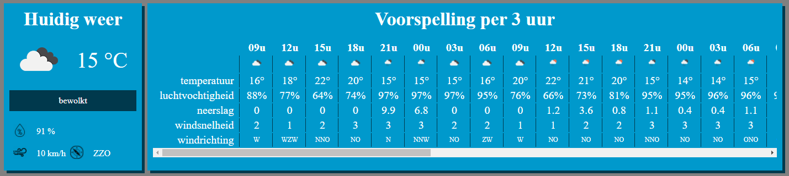

# Weersvoorspelling


## Opdracht
Ontwerp volgende webpagina:

PHP:
* De weersvoorspelling opvragen via de WEB-API van openweathermap.org
* Het resultaat in een array bewaren.
* Deze array vervolgens tonen in een HTML tabel.

CSS:
* Voorzie styling via bootstrap

Javascript:
* Een balk grafiek maken van de temperaturen via Google chart (dus op basis van de gegevens uit de HTML tabel).

## Tips

Jou PHP gedeelte van de webpagina zou er bv. zo kunnen uitzien:



Het opvragen van de weersvoorspelling kan via https://api.openweathermap.org/data/2.5/forecast.

Om de array in het json object antwoord te doorlopen kan je bv. als volgt te werk gaan:

```php
// doorlopen van de array list in het object
foreach ($data['list'] as $key) {
    // de info van de temperatuur zit dan bv in
    $temp = $key['main']['temp'];
}
```

Gebruik in Javascript een selector om de gegevens uit de tabel te halen.
Maak gebruik van bv een class om die te kunnen onderscheiden van de rest van de info op de pagina.

## Evaluatie

Deze opdracht staat op **7.5%** van de totaalscore voor het vak Web Development 3.

Er zal op het volgende geëvalueerd worden:
* Is je opbouw van de pagina volgens het ‘good-practice’ principe is.
* Is de basis HTML, CSS en JS correct gebruikt.
* Is je PHP correct geschreven.
* Zijn de minimum gevraagde items aanwezig en correct geïmplementeerd.

