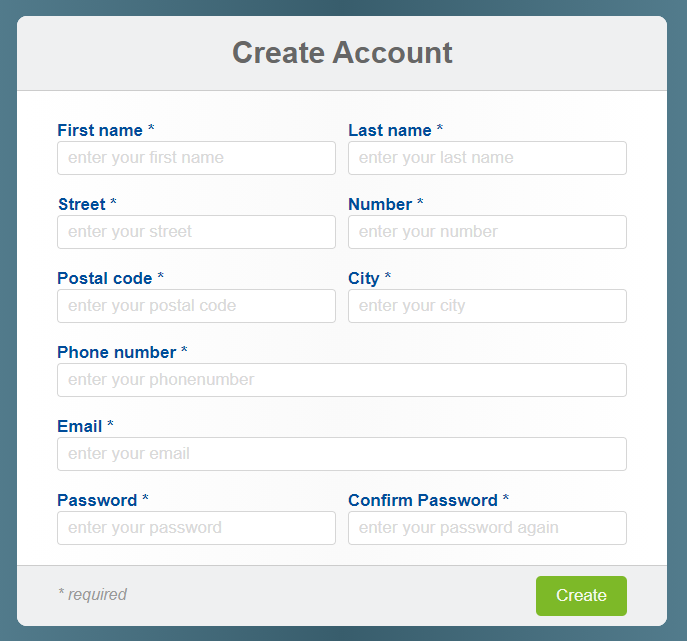

# Registratie- en loginform

Voor deze opdracht heb je de rest van de leerstof uit deze cursus nodig. Je zal er dus verschillende weken aan werken.

## Opdracht 1 - Users database
Ontwerp een database met volgende kenmerken:
* De database heeft de naam `DB_IOT`
* Een applicatiegebruiker `dash_app` met de juiste rechten is voorzien
* Een tabel met de naam `USERS` is voorzien (kies zelf de veldnamen)
* Een script wordt opgemaakt waarmee deze database kan gebouwd worden.

## Opdracht 2 - Registratieform
Ontwerp volgende 'Single Page' registratie voor een dashboard site.

**FORM:**

In je php file `register.php` zit een stuk HTML met een form die volgende input van de gebruiker verwacht:
* Voornaam
* Naam
* Adres
* Huisnummer
* Postcode
* Stad
* Telefoonnummer
* Email
* Dubbele wachtwoord input

De submit van deze form verwijst dus naar dezelfde pagina en gebruikt hierbij de HTTP POST request techniek.

Jou registratieform zou er bv zo kunnen uitzien:

**PHP:**

1. Je valideert alle inputvelden als volgt:

    * Alle velden zijn verplicht
    * Lege of foutieve velden worden in het rood omkaderd.
    * De velden 'telefoonnummer', 'email' en 'wachtwoord' worden via een reguliere expressie gevalideerd.
    * Fouten bij de velden 'telefoonnummer', 'email' en 'wachtwoord' worden aan de gebruiker gesignaleerd in een rode tekst net onder de invulvelden en boven de submit knop.
    * Het wachtwoord is minstens 8 tekens lang en bevat minstens 1 hoofdletter, 1 cijfer en 1 ander teken.
    * Als alles correct is ingevuld verschijnt een "Bedankt voor uw registratie..." boodschap op de pagina.

2. Een gevalideerde input verwerken:

    * Je stopt alle inputs in een associative array.
    * Je genereerd een APIkey
    * Je voegt deze user informatie toe aan de database.
    * Er wordt een bevestigingsmail verstuurd met een HTML body die er bv zo zou kunnen uitzien:

**CSS:**

* Voorzie je eigen styling voor deze pagina.

**Javascript:**

* Er wordt geen gebruik gemaakt van Javascript voor deze opdracht.

## Opdracht 3 - Loginform
Ontwerp volgende 'Single Page' login voor een dashboard site:

**FORM:**

In je php file `login.php` zit een stuk HTML met een form waarmee je a.d.h.v. een email en paswoord kan inloggen.
De submit van deze form verwijst dus naar dezelfde pagina en gebruikt hierbij de HTTP POST request techniek.

**PHP:**

* Je kijkt of deze gebruiker bestaat en als zijn of haar wachtwoord correct is.
* Als het om een geldige login gaat dan start je een sessie en verwijs je door naar een welkomstpagina `welkom.php`.

::: warning Let op !
Als iemand de url van de welkomstpagina `welkom.php` in de browser intikt mag deze pagina niet laden maar moet je doorverwezen worden naar de login pagina. Deze pagina mag enkel laden als een geldige sessie actief is.
:::

* Geef op de welkomstpagina alvast de gegevens van de ingelogde persoon weer.

**CSS:**

* Gebruik dezelfde styling als voor de registratie pagina.

**Javascript:**

* Er wordt geen gebruik gemaakt van Javascript voor deze opdracht.

## Tips

* Een 'single page' form is dus een form waarvan de submit verwijst naar dezelfde pagina en gebruikt hierbij de HTTP POST request techniek. Het PHP gedeelte van deze pagina zal pas actief komen bij een HTTP POST benadering van de pagina.
* Zorg dat de basis interactie met een database terugkomt in je code.
* Gebruik commentaar om leesbaarheid in je code te brengen.
* Gebruik terug je Gmail-account dat je speciaal aangemaakt hebt voor applicaties.
* Let op: een wachtwoord moet steeds versleuteld zijn!

## Evaluatie

Deze opdracht staat op **35%** van de totaalscore voor het vak Web Development 3.

Er zal op het volgende geëvalueerd worden:
* Is je opbouw van de pagina volgens het ‘good-practice’ principe is.
* Is de basis HTML en CSS correct gebruikt.
* Is je SQL script correct.
* Is je PHP correct geschreven.
* Zijn de minimum gevraagde items aanwezig en correct geïmplementeerd.

