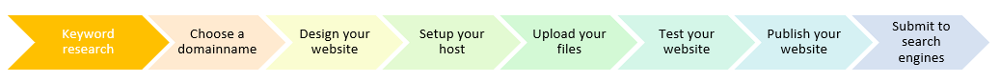
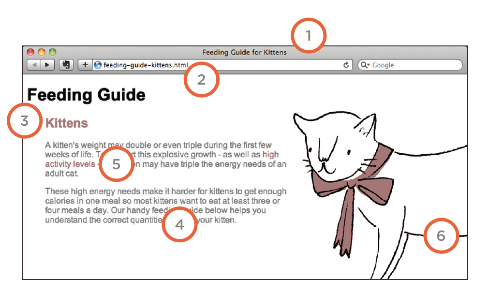

# Publiceren van je website

Je hebt uren gespendeert om je website te bouwen en nu moet die publiek geplaatst worden.
Je hebt hiertoe eerst en vooral een Web Host nodig.

## Een geschikte Web Host zoeken

### Gedeelde Web Hosts

Je eerste optie is het gebruik van een van de populaire hosting platforms zoals Combell, One, Neostrada en Argeweb. De eigenlijke server waar jouw website is opgeslagen is eigendom van de hosting service en is gedeeld met andere websites.

Gedeelde hosting is een betaalbare optie, maar het heeft ook nadelen zoals langzame pagina laadtijden of downtime. Sommige platforms beperken ook RAM en CPU gebruik, wat kan leiden tot prestatieproblemen voor je website.

### Managed Web Hosts

Managed hosting, in het kort, betekent dat het hostingbedrijf zoals Nucleus of Hostnet de setup, administratie en het onderhoud van de servers afhandelt.

Managed hosting kost iets meer dan shared hosting, maar de investering betaalt zich altijd terug in termen van betere prestaties, beveiliging, ondersteuning en een verbeterde workload.

### DIY Host

Een andere optie is om zelf de volledige verantwoordelijkheid voor het configureren, updaten, en onderhouden van jouw website servers op te nemen.

Het klinkt misschien als een goede deal, omdat je niet hoeft te betalen een managed hosting provider. Maar het is veel werk en vereist een grote mate van technische expertise.

Als je niet beschikt over de middelen om regelmatige back-ups, security scans, en ander onderhoud te beheren, dan is DIY hosting niets voor jou.

## Uploaden bestanden en testen

Nu je een Web Host hebt kan je jou bestanden en folderstructuur uploaden.

Voor je de website effectief publiceert is het verstandig om in een kleine groep of in preview mode de website grondig te testen.

## Publiceren

Het moment van de waarheid, je kan eindelijk de website delen met de wereld.
Je kan nu je domain naam kopen, de webhost configureren en vervolgens publiceren.

Iedereen kan nu je website raadplegen maar daarom is hij nog niet direct vindbaar.
Het is nu kwestie van je website te registreren bij zoekmachines.

Om je website bij Google in te dienen, gebruik je [Google Search Console](https://search.google.com/search-console/welcome?utm_source=about-page), en verifieer je de eigendom van de website.

1. Ga naar Google Search Console en log in met je google account (als je nog niet bent ingelogd via Google Chrome).
2. Voeg nu je domainnaam toe
3. Om te bewijzen dat je eigenaar bent van dit domain gebruik je gewoon het DNS TXT record.

## Search Engine Optimization (SEO)

De kern van SEO is uitzoeken welke termen mensen waarschijnlijk zullen invoeren in een zoekmachine om uw site te vinden en dan deze termen te het gebruiken op de juiste plaatsen op uw site om de kans te vergroten dat zoekmachines een link naar uw site zullen tonen in hun resultaten.

Om te bepalen wie er eerste komt in de zoekresultaten, kijken zoekmachines niet alleen naar wat op uw site staat. Ze kijken ook hoeveel sites linken naar u (en hoe relevant die links zijn). Om deze reden wordt SEO vaak opgesplitst in twee gebieden: on-page technieken en off-page technieken.

**On-page technieken**

Dit zijn de methoden die je kan gebruiken op jouw webpagina's om hun 'rating' te verbeteren in zoekmachines.
Het belangrijkste onderdeel hiervan is het kijken naar trefwoorden die mensen waarschijnlijk zullen invoeren in een zoekmachine om jouw site te vinden, en dan deze dan in de tekst en HTML-code voor jouw site op te nemen om de zoekmachines te helpen ontdekken dat jouw site deze onderwerpen behandelt.

Zoekmachines vertrouwen zeer sterk op de tekst die in jouw pagina's staat, dus het is belangrijk dat de juiste zoektermen in de tekst staan. Er zijn zeven essentiële plaatsen hiervoor waar dit kan.

**Off-page technieken**

Andere sites naar jouw site laten linken is net zo belangrijk als op de on-page technieken. Zoekmachines bepalen de belangrijkheid van jouw pagina door te bekijken hoeveel andere websites naar jouw pagina linken. Ze zijn bijzonder geïnteresseerd naar sites waarvan de inhoud gerelateerd is naar de jouwe. Zoekmachines kijken ook naar de woorden tussen de opening `<a>` tag en afsluitende `</a>` tag in de koppeling. Als de tekst in de link informatie bevat i.p.v. 'klik hier' is dat meer relevant.

### De zeven plaatsen van keywords op een pagina

1. Pagina titel

    De titel in de hoofding van de het browservenster
2. URL of web adres

    De naam van een URL kan belangrijke keywords bevattten.
3. Hoofdingen

    In een titel kan je ook keywords verwerken
4. Tekst

    Als je minstens 2 tot 3 keer keywords herhaald in je tekst wordt dit ook opgepikt maar verdrijf niet met deze herhalingen.
5. Link tekst

    De tekst die je gebruikt bij een link kan ook keywords bevatten.    
6. Alt tekst bij een afbeelding

    Zorg voor een accurate beschrijving van een afbeelding in de alternatieve tekst, hiermee zal een zoekmachine je afbeeldingen gebruiken bij het zoeken.    
7. De pagina omschrijving 

    In de meta data kan je eveneens de beschrijving van de pagina bepaalde keywords gebruiken.

